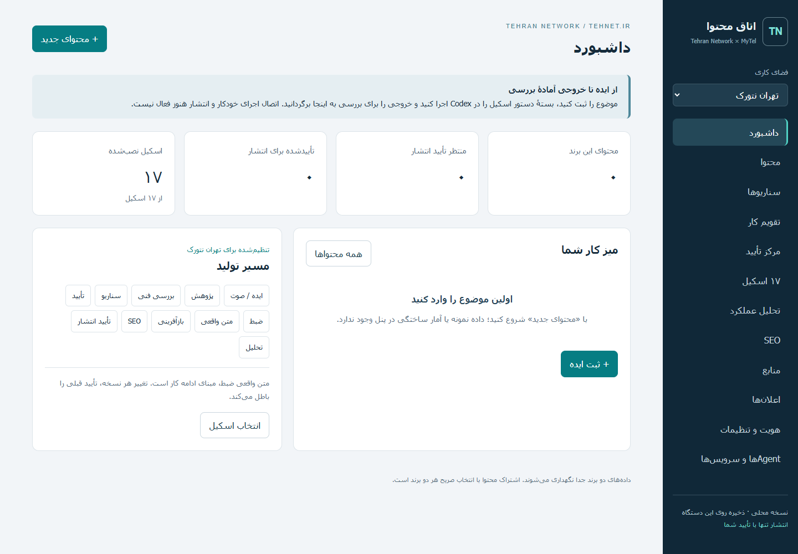
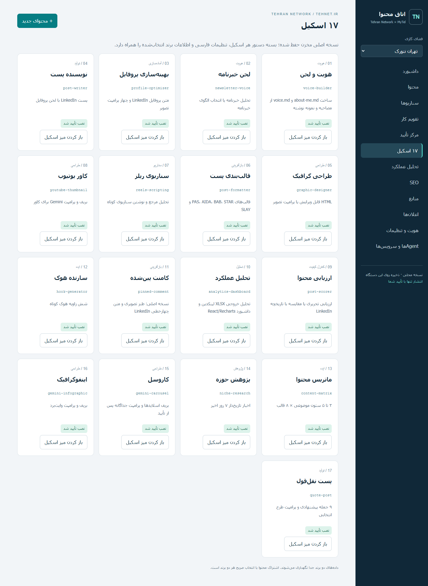
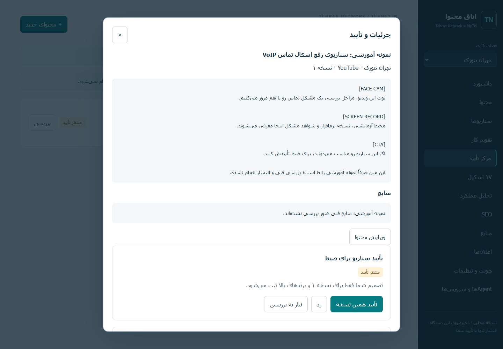
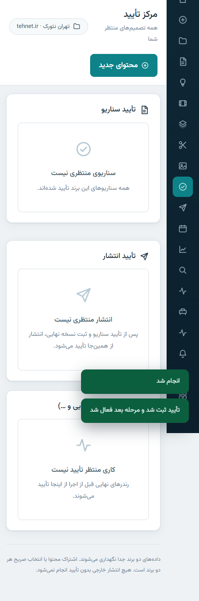

# اتاق محتوای تهران نتورک و MyTel

[English README](README.en.md) · [راهنمای روزانه](outputs/README.fa.md) · [گزارش بررسی سیستم](outputs/audit.fa.md) · [نتایج آزمون](outputs/verification.fa.md)

پنل محلی فارسی و راست‌به‌چپ برای مدیریت ایده، سناریو، متن واقعی ضبط، منابع و تأیید نسخه‌های محتوا؛ همراه ۱۷ اسکیل تولید محتوای Codex، تنظیمات مستقل **Tehran Network / tehnet.ir** و **MyTel / mytel.one**.

**وضعیت واقعی:** علاوه بر دفتر محتوا و تأیید نسخه‌دار، اجرای خودکار روی همین دستگاه فعال است: آپلود صوت/ویدیو (فایل اصلی تغییرناپذیر)، تبدیل گفتار به متن با مدل محلی و GPU، تحلیل تدوین خودکار با تصمیم‌های غیرمخرب و بازگرداندن برش، رندر پیش‌نمایش و نهایی با NVENC، صف کار زنده و بسته dry-run انتشار. هیچ‌یک از این‌ها چیزی به اینترنت منتشر نمی‌کند؛ انتشار واقعی، Analytics زنده و همگام‌سازی چند دوربین هنوز متصل نیستند و بدان‌سو ادعایی نمی‌رود.



## شروع سریع

پیش‌نیاز اجرای پنل: **Python 3.10+**. هیچ pip، Docker، Node یا API Key برای خود پنل لازم نیست. Git فقط برای دریافت مخزن است. اجرای اسکیل‌ها به Codex و ابزارهای موردنیاز همان مسیر نیاز دارد.

```bash
git clone https://github.com/DashSaman/Tolid-mohtava.git
cd Tolid-mohtava
python scripts/install_skills.py
python scripts/start_panel.py
```

در Windows می‌توانید به‌جای `python` از `py -3` استفاده کنید. بعد از نصب Python، دوبار کلیک روی **Open-Panel.cmd** پنل را اجرا و مرورگر را باز می‌کند. نشانی پیش‌فرض: **http://127.0.0.1:8766**. راه‌انداز سرویس‌های GrowthOS را شروع یا تغییر نمی‌دهد.

اگر بازکردن مرورگر خودکار در محیط محدود مجاز نبود:

```bash
python scripts/start_panel.py --no-browser
```

سپس نشانی بالا را دستی باز کنید. اجرای مستقیم با خطاهای قابل‌مشاهده: `python outputs/panel/server.py`.

اسکریپت نصب از نسخهٔ ثابت داخل مخزن استفاده می‌کند و پیش از کپی، hashها را کنترل می‌کند. مقصد پیش‌فرض `.agents/skills` در همین پروژه است. پوشه‌های قبلی را **بازنویسی نمی‌کند**. برای نصب شخصی سراسری، فقط در صورت نیاز، `python scripts/install_skills.py --global` را اجرا کنید؛ نصب هم‌زمان محلی و سراسری لازم نیست. در سیستم اولیه، هر ۱۷ اسکیل قبلاً سراسری نصب شده‌اند. نوبت تازهٔ Codex باید همین پروژه را باز کند تا AGENTS.md و پروفایل‌ها خوانده شوند.

## روال روزانه

1. برند را از بالای نوار کناری انتخاب کنید.
2. «محتوای جدید» را بزنید؛ ایده یا سناریو را وارد و ذخیره کنید.
3. از «۱۷ اسکیل»، اسکیل مناسب را باز کنید، پرونده محتوا را انتخاب کنید و درخواستتان را بنویسید.
4. «آماده‌سازی دستور فارسی» و سپس «کپی دستور» را بزنید؛ دستور را در نوبت بعدی Codex همین پروژه اجرا کنید.
5. خروجی را به پرونده محتوا برگردانید. پس از ضبط، متن واقعی را ثبت کنید؛ مبنای بازآفرینی همین متن است.
6. در «مرکز تأیید»، نسخه و برندهای مقصد را ببینید و سناریو یا انتشار را جداگانه تأیید، رد یا برای بررسی علامت‌گذاری کنید.

این رفت‌وبرگشت با Codex فعلاً دستی است. دکمه‌ای که اجرای متصل AI یا انتشار را شبیه‌سازی کند وجود ندارد.

## همه بخش‌های پنل

| بخش | کار واقعی |
|---|---|
| داشبورد | خلاصه واقعی: در حال تولید، منتظر تأیید، ضبط/تدوین، آماده انتشار، کار ناموفق + پروژه‌های اخیر، کارهای در جریان، سلامت سیستم |
| تولید محتوا | ویزارد ۴ مرحله‌ای: برند ← نوع ورودی (متن / ضبط صدا / آپلود صوت) ← موضوع ← ساخت پروژه؛ با صوت، تبدیل به متن خودکار همین‌جا اجرا می‌شود |
| پروژه‌های محتوا | دفتر پرونده‌های برند با جست‌وجو |
| صفحه پروژه | فضای کاری کامل: نمای کلی، تحقیق، سناریو، رسانه، Transcript، تدوین، Shorts، تصاویر، SEO، انتشار، Analytics، تاریخچه + خط زمان ۱۰ مرحله‌ای |
| رسانه و تدوین | آپلود تغییرناپذیر صوت/ویدیو، پخش، متن نسخه‌دار با Seek، گزارش تدوین فارسی، بازگردانی برش، رندر Preview/نهایی |
| نسخه‌های ویدیو | فهرست RAW محافظت‌شده + همه رندرها (مدت، حجم، موتور، پخش) |
| Shorts / Reels | کاندیداهای واقعی از transcript + رندر عمودی ۹:۱۶ با پس‌زمینه محو |
| تصاویر و Thumbnail | آپلود و تأیید/رد دستی؛ تولید تصویر «BLOCKED — Credential Required» |
| مرکز تأیید | تأیید سناریو، تأیید انتشار، تأیید کارها (رندر نهایی) با دکمه‌های تأیید/رد/نیاز به اصلاح |
| انتشار | وضعیت واقعی مقصدها (همه نیازمند Credential) + بسته‌های dry-run |
| تقویم / ایده‌ها / منابع | موعدهای ثبت‌شده، ایده‌ها، منابع پروژه‌ها |
| Analytics | «حساب متصل نیست» — هیچ نمودار ساختگی نمایش داده نمی‌شود |
| کارها | جدول صف کارها با فیلتر وضعیت، پیشرفت، مدت، تلاش مجدد، لاگ و جزئیات |
| فضای ذخیره‌سازی | دیسک‌های واقعی (آزاد/کل)، مصرف پنل، وضعیت My Passport (در صورت نبود: «در دسترس نیست» و هیچ حذف خودکاری نیست) |
| سلامت سیستم | وضعیت واقعی Python/FFmpeg/faster-whisper/GPU/NVENC/DB/Worker + آزمون GPU؛ LLM/SEO/انتشار «نیازمند Credential» |
| ۱۷ اسکیل و تنظیمات | بسته دستور فارسی هر اسکیل + پروفایل برند و سیاست |



## ۱۷ اسکیل نصب‌شده

منبع: [charlie947/social-media-skills](https://github.com/charlie947/social-media-skills)، commit ثابت `8cefb5b6d03757885faa6918bd8bfaef202a83db`. نسخه‌های اصلی بدون تغییر در `vendor`، با مجوز MIT و انتساب Charlie Hills حفظ شده‌اند. تطبیق فارسی در **سیاست و پروفایل پروژه** اعمال می‌شود، نه با تغییر متن اصلی اسکیل.

| اسکیل | وظیفه و وابستگی واقعی | تطبیق این پروژه |
|---|---|---|
| [`voice-builder`](vendor/social-media-skills/skills/voice-builder/SKILL.md) | ساخت about-me.md و voice.md از مصاحبه و نمونه نوشته؛ ۳ تا ۵ نمونه واقعی برای تشخیص سبک | پاسخ‌های موجود استفاده شود؛ لحن درخواستی فارسی است؛ سبک شخصی هنوز با نمونه تأیید نشده |
| [`newsletter-voice`](vendor/social-media-skills/skills/newsletter-voice/SKILL.md) | تحلیل خبرنامه یا انتخاب الگوی خبرنامه؛ پروفایل برند و ۲ خبرنامه یا انتخاب الگو | خبرنامه اختیاری؛ هیچ نمونه یا امضای شخصی ساخته نشود |
| [`profile-optimizer`](vendor/social-media-skills/skills/profile-optimizer/SKILL.md) | متن پروفایل LinkedIn و چهار پرامپت تصویر؛ پروفایل واقعی، خدمات و شواهد؛ عکس برای تصویر | برند و سوابق واقعی؛ ذخیره پیش‌نویس بدون تغییر حساب |
| [`post-writer`](vendor/social-media-skills/skills/post-writer/SKILL.md) | پست LinkedIn با لحن پروفایل؛ موضوع و about-me.md و voice.md | فارسی، منابع فنی، CTA واقعی؛ نسخه مستقل هر پلتفرم |
| [`graphic-designer`](vendor/social-media-skills/skills/graphic-designer/SKILL.md) | HTML قابل ویرایش یا پرامپت تصویر؛ متن؛ مرورگر برای خروجی PNG یا مولد برای تصویر | فارسی RTL و خوانایی موبایل؛ پرامپت معادل تصویر نهایی نیست |
| [`post-formatter`](vendor/social-media-skills/skills/post-formatter/SKILL.md) | قالب‌های PAS، AIDA، BAB، STAR و SLAY؛ موضوع و اطلاعات تأییدشده | محدودیت‌های LinkedIn به سناریوی بلند تحمیل نشوند |
| [`reels-scripting`](vendor/social-media-skills/skills/reels-scripting/SKILL.md) | تحلیل مرجع و نوشتن سناریوی کوتاه؛ متن پیاده‌شده؛ مسیر ویدیو: Apify و Gemini و Node SDK | متن واقعی ضبط مبنا؛ مارکرهای تولید و بررسی فنی؛ تحلیل ویدیو بدون اجرای آن ادعا نشود |
| [`youtube-thumbnail`](vendor/social-media-skills/skills/youtube-thumbnail/SKILL.md) | بریف و پرامپت Gemini برای کاور؛ عنوان، محتوای واقعی، عکس مرجع و هویت بصری | عنوان، هوک و کاور یک وعده مشترک؛ انتخاب مبتنی بر داده در صورت وجود |
| [`post-scorer`](vendor/social-media-skills/skills/post-scorer/SKILL.md) | ارزیابی تحریری یا مقایسه با تاریخچه LinkedIn؛ پیش‌نویس؛ تاریخچه اختیاری؛ Apify اختیاری | امتیاز مستدل؛ فنی، SEO و تناسب برند اضافه؛ امتیاز مجوز انتشار نیست |
| [`analytics-dashboard`](vendor/social-media-skills/skills/analytics-dashboard/SKILL.md) | تحلیل خروجی XLSX لینکدین و داشبورد React/Recharts؛ خروجی واقعی LinkedIn؛ runtime برای نمودار تعاملی | تفکیک برند و پلتفرم؛ تحلیل هفتگی؛ معیار غایب ناموجود است |
| [`pinned-comment`](vendor/social-media-skills/skills/pinned-comment/SKILL.md) | نسخه اصلی: طنز تصویری و متن چهارخطی LinkedIn؛ پست و زمینه واقعی؛ عکس برای مسیر تصویری | برای شما گفت‌وگوی کاربردی و هدایت نرم؛ طنز و تصویر اجباری نیست؛ تأیید قبل انتشار |
| [`hook-generator`](vendor/social-media-skills/skills/hook-generator/SKILL.md) | شش زاویه هوک کوتاه؛ موضوع و شواهد واقعی | پیشنهاد برتر Agent و سه گزینه نهایی؛ بدون کلیک‌بیت گمراه‌کننده |
| [`content-matrix`](vendor/social-media-skills/skills/content-matrix/SKILL.md) | ۳ تا ۵ ستون موضوعی × ۸ قالب؛ موضوعات برند و داده‌های موجود | برای هر برند مستقل؛ اولویت براساس نیاز مخاطب، جست‌وجو و ارزش کسب‌وکار |
| [`niche-research`](vendor/social-media-skills/skills/niche-research/SKILL.md) | اخبار تاریخ‌دار ۷ روز اخیر؛ دسترسی وب یا منابع تاریخ‌دار | تحقیق پیش‌تولید فراتر از اخبار؛ منابع رسمی مقدم؛ کمبود پوشش آشکار |
| [`gemini-carousel`](vendor/social-media-skills/skills/gemini-carousel/SKILL.md) | بریف اسلایدها و پرامپت جداگانه پس از تأیید؛ محتوا و هویت بصری؛ Gemini برای رندر | اسلاید فارسی، بررسی تک‌تک خروجی‌ها؛ تأیید بریف |
| [`gemini-infographic`](vendor/social-media-skills/skills/gemini-infographic/SKILL.md) | بریف و پرامپت وایت‌برد؛ محتوا؛ Gemini برای رندر | حفظ همه نکات فنی، حروف فارسی خوانا، CTA مرتبط |
| [`quote-post`](vendor/social-media-skills/skills/quote-post/SKILL.md) | ۹ جمله پیشنهادی و پرامپت طرح انتخابی؛ کپشن و مرجع سبک | محتوای تخصصی مرتبط؛ بدون نسبت‌دادن جعلی و وعده عملکرد |

وضعیت «نصب تأیید شد» از بررسی فایل واقعی در `.agents/skills` یا `CODEX_HOME/skills` به‌دست می‌آید؛ صرف clone کردن، نصب نیست. نشانگر پنل hash فایل SKILL.md را بررسی می‌کند؛ تأیید هر ۱۹ فایل در manifest و تست نصب انجام می‌شود. نسخه شخصی تغییرکرده به‌عنوان نسخه pinned تأیید نمی‌شود ولی بازنویسی هم نمی‌شود.

## Agentها، ابزارها و آنچه واقعاً نصب شد

| جزء | وضعیت و وظیفه |
|---|---|
| Codex | اجراکننده فعلی اسکیل‌ها در چت؛ پنل فقط بسته دستور می‌سازد |
| ۱۷ اسکیل | موارد تازه نصب‌شده؛ ۱۹ فایل با hash یکسان با منبع |
| پنل Python + SQLite | سورس تازه ساخته‌شده؛ از Python موجود و کتابخانه استاندارد استفاده می‌کند |
| OpenHands | ارجاع در فایل‌های GrowthOS؛ نشانی تاریخی `localhost:8000/canvas/`؛ اتصال زنده تأیید نشده |
| DispatchSEO | ارجاع در GrowthOS؛ `localhost:4005`؛ سرویس جدید نصب نشده |
| Activepieces | ارجاع در GrowthOS؛ `localhost:8080`؛ اتوماسیون موجود تغییر نکرده |
| Uptime Kuma | ارجاع در GrowthOS؛ `localhost:3001`؛ سلامت زنده از این پنل دریافت نمی‌شود |
| Ollama | ارجاع در راه‌انداز موجود؛ endpoint در بررسی اولیه قابل دسترسی نبود |
| LM Studio | پوشه‌ها و مدل‌های DeepSeek-R1-0528-Qwen3-8B-GGUF و Meta-Llama-3-8B-Instruct-GGUF از قبل موجود؛ هیچ مدل جدیدی دانلود نشد |
| DashSaman/-SEO | مستندات و چک‌لیست‌های محلی قبلی پیدا و برای استفاده مجدد معرفی شدند |
| Gemini و Apify | وابستگی اختیاری بعضی اسکیل‌ها؛ حساب/SDK/کلید یا اجرای پولی جدید ایجاد نشد |
| Chrome و Playwright | ابزارهای موجود برای تست رابط؛ مرورگر جدید نصب نشد |
| WSL / Docker | خواندن وضعیت WSL محدود بود؛ موجودی کامل کانتینرها و نیاز به Update نامعلوم است |

جزئیات همه ابزارهای درخواست‌شده، هم‌پوشانی‌ها، Gapها و Credentialهای احتمالی در [Audit](outputs/audit.fa.md) آمده است. **وجود اسکریپت یک سرویس به معنی فعال‌بودن آن نیست.**

## هویت و قواعد تأیید

- [سیاست مشترک](outputs/content-policy.fa.md) و [پاسخ‌های مبنا](outputs/master-prompt.fa.md).
- [تهران نتورک](outputs/brands/tehran-network/about-me.md): برند اصلی محتوای فنی؛ [لحن](outputs/brands/tehran-network/voice.md).
- [MyTel](outputs/brands/mytel/about-me.md): VoIP، Issabel، FreePBX، SIP و CRM؛ [لحن](outputs/brands/mytel/voice.md).
- لحن محاوره‌ای از دستور شما تنظیم شده؛ یادگیری دقیق سبک با ۳ تا ۵ نمونه نوشته هنوز تأیید نشده است.
- ویدیو مشترک با تهران نتورک شروع می‌شود؛ معرفی MyTel زمینه‌مند و بدون لوگوی دائمی است.
- عنوان، کاور و هوک وعده مشترک دارند؛ ادعای فنی باید منبع داشته باشد.
- تأیید سناریو با تأیید انتشار متفاوت است. ویرایش، تأییدهای نسخه قبل را باطل می‌کند. تصمیم نسخه قدیمی رد می‌شود. تأیید تکراری تاریخچهٔ تکراری نمی‌سازد.



تصویر بالا از پایگاه دادهٔ جداگانهٔ آزمون است؛ محتوای واقعی یا منتشرشده نیست.

## معماری و نگهداری داده

```text
مرورگر فارسی (RTL) ← HTTP فقط loopback ← Python stdlib ← SQLite (WAL)
                                              ↓
                          صف کارها ← Workerهای محلی: تبدیل گفتار (faster-whisper، GPU/CPU خودکار)،
                          تحلیل تدوین (FFmpeg silencedetect)، رندر Preview/Final (NVENC)،
                          رندر عمودی Shorts، بسته dry-run انتشار
```

فایل داده `outputs/panel/data/content.sqlite` و backupها از Git خارج‌اند. خروجی JSON شامل تاریخچه است؛ برای بازیابی کامل، از `Backup-Panel.cmd` یا `python outputs/panel/backup.py` استفاده کنید. برای restore، فقط فرایند همین پنل را ببندید، فایل قبلی را نگه دارید و backup را به مسیر SQLite برگردانید. هیچ سرویس GrowthOS نیاز به تغییر ندارد.

تنظیمات اختیاری محیط: `TEHNET_PANEL_PORT` (پیش‌فرض 8766)، `TEHNET_PANEL_DB` (مسیر داده؛ در مسیر پیش‌فرض backup اسکریپت قرار ندارد)، `CODEX_HOME` (مسیر اسکیل‌های سراسری). اسکریپت backup مسیر پیش‌فرض DB را پشتیبان می‌گیرد؛ اگر DB سفارشی دارید از SQLite backup برای همان فایل استفاده کنید.

این نسخه تک‌کاربره و مخصوص دستگاه محلی است. احراز هویت چندکاربره و اینترنتی ندارد. Host/Origin و token درخواست برای نوشتن بررسی می‌شوند، متن کاربر escape می‌شود، endpoint انتشار و دسترسی HTTP به DB وجود ندارد. خطاهای UI فارسی‌اند؛ خروجی CLI ابزارهای توسعه ممکن است انگلیسی باشد.

## ساختار مخزن

```text
README.md / README.en.md    راهنمای فارسی و انگلیسی
AGENTS.md                  قرارداد Agentهای این پروژه
Open-Panel.cmd             راه‌انداز Windows
Backup-Panel.cmd           پشتیبان Windows
scripts/                   نصب اسکیل‌ها و راه‌انداز قابل‌حمل
outputs/panel/             server، store، registry و HTML/CSS/JS
outputs/brands/            هویت و لحن مستقل هر برند
outputs/*.md               پاسخ‌های مبنا، سیاست، Audit و شواهد آزمون
outputs/installation-manifest.json  نسخه منبع و hashها
vendor/social-media-skills/ نسخه اصلی ۱۷ اسکیل و مجوز
docs/images/               تصاویر واقعی رابط و نمونه آموزشی
docs/                      راهنمای فنی، وضعیت و سابقه کار
tests/                     تست‌های ذخیره‌سازی، نصب، HTTP و مرورگر
```

## آزمون و شواهد

```bash
python -m unittest discover -s tests -v
python tests/check_docs.py
node --check outputs/panel/app.js
```

آزمون مرورگر اختیاری: با Node و Playwright موجود، `node tests/ui-flow.cjs` را اجرا کنید. متغیر `PLAYWRIGHT_MODULE` می‌تواند مسیر پکیج موجود و `PYTHON` مسیر Python را مشخص کند؛ نصب خودکار وابستگی انجام نمی‌شود. Chrome نصب‌شده استفاده می‌شود. دادهٔ آزمون در `work/` و جدا از پنل است.

[راهنمای کامل کاربر فارسی](docs/README.fa.md) · [شروع سریع](docs/QUICKSTART.fa.md) · [نصب](docs/INSTALLATION.fa.md) · [انتقال به سیستم جدید](docs/MIGRATION.fa.md) · [ماتریس قابلیت‌ها](docs/FEATURES.fa.md) · [استفادهٔ روزانه](docs/DAILY-USE.fa.md) · [اتصال حساب‌ها](docs/CREDENTIALS-GUIDE.fa.md) · [معماری](docs/ARCHITECTURE.md)

[راهنمای توسعه و API](docs/TECHNICAL.md) · [سابقه اقدامات](docs/CHANGELOG.md) · [شواهد نسخه اولیه](outputs/verification.fa.md)

## نمایش موبایل



## مراحل بعد، هنوز انجام‌نشده

انتشار واقعی پلتفرم‌ها و Analytics واقعی (هر دو آماده ولی نیازمند OAuth شما)؛ تولید تصویر Gemini (نیازمند کلید). همگام‌سازی چند دوربین، تدوین غیرمخرب، رندر، Shorts (ساده + رتبه‌بندی هوشمند V2)، معماری Analytics با snapshotهای append-only، حلقهٔ یادگیری، زمان‌بندی تطبیقی، بهینه‌سازی پس از انتشار، برنامهٔ هفتگی، جریان پیشنهادهای سئو، آرشیو My Passport، احراز هویت و مرکز اتصال حساب‌ها اکنون **پیاده‌سازی و تست‌شده‌اند**. وضعیت دقیق هر قابلیت در `docs/implementation-status.json` و `docs/CONTINUATION_STATUS.md`.

## انتساب و مجوز

اسکیل‌های ثالث متعلق به Charlie Hills و تحت [MIT](vendor/social-media-skills/LICENSE) هستند. [یادداشت منبع و نسخه](docs/THIRD_PARTY.md) را ببینید. برای کد اختصاصی پنل هنوز مجوز متن‌باز مستقلی اعلام نشده است؛ مجوز اسکیل‌ها مجوز کل پروژه محسوب نمی‌شود.
