# ARCHITECTURE — Tolid-mohtava

Single-machine, local-first Persian content factory. Python stdlib panel + local engines + optional credential-gated external adapters. SQLite (WAL) is the only store; RAW media is immutable; every externally-visible action is approval-gated.

```mermaid
flowchart LR
  subgraph UI[Persian RTL Panel - vanilla JS]
    W[Wizard] 
    PRJ[Project 13 tabs]
    APR[Approval Center]
    AN[Analytics/Planner]
    SET[Settings/Integrations]
  end
  subgraph CORE[Core - owns ALL state]
    HTTP[server.py loopback+token+CSP]
    JQ[jobs.py persistent queue\nstates+observability+retry-cap]
    ST[(SQLite WAL\ncontent/media/transcripts/\ndecisions/renders/analytics/\nseo-history/kb/keywords)]
  end
  subgraph ENGINES[Local engines]
    TR[faster-whisper GPU/CPU]
    AI[ai.py providers\nLM Studio Qwen default]
    SK[skill_router 17 SKILL.md]
    ED[editing.py non-destructive]
    RD[render.py NVENC]
    SY[sync.py waveform+clap]
    SE[seo_engine crawler]
    IN[intelligence/KB/content_intel]
  end
  subgraph EXT[Optional - credential-gated]
    WP[WordPress REST x2]
    TG[Telegram]
    SOC[YouTube/Meta/LinkedIn OAuth]
    G[GA4/GSC/Ads keywords]
    RUF[Ruflo] 
    SF[Screaming Frog]
  end
  UI-->HTTP-->JQ-->ENGINES-->ST
  ENGINES-->EXT
  EXT-- BLOCKED_BY_CREDENTIAL without keys -->HTTP
```

## Ownership rules (non-negotiable)
- **Core owns:** job queue, approvals, credentials (env-name references only), publishing state, media storage, analytics/SEO history. Adapters NEVER own these.
- **RAW immutability:** media files write-once; edits are decision rows; renders are new files.
- **Approval gating:** script/publish gates (content), waiting_approval (jobs incl. FINAL render, archive copy), proposals (optimization/SEO). Idempotency keys are strict — same key ⇒ same job forever.

## Data flow: voice → published-ready
1. Wizard creates content + uploads voice (sha256, immutable).
2. `transcribe_audio` (whisper, model from settings; medium default per real fa-IR benchmark 76% overlap, RTF 0.11 CUDA) → versioned transcript.
3. AI jobs (`research_topic` → `technical_verification` → `generate_script` → hooks → packages; article from transcript). Structured output pipeline: extract(fenced/balanced/repair/markdown-KV) → validate → one stricter retry → honest parse_error. URLs really fetched (live/dead/needs-verification).
4. Recording ingest (face/screen/external_audio) → `sync_content` (common-format preprocessing: mono 8k band-pass speechnorm + windowed-Pearson + clap confirm; low confidence ⇒ review + manual offset) → optional `enhance_audio` (new ENHANCED Vn file).
5. `edit_detect` (FFmpeg silencedetect + transcript fillers/repeats; conservative auto-activate) → decision rows (active/restored/proposed/dismissed; user verdicts survive re-analysis) → `render_cut` preview & approval-gated FINAL → `shorts_v2` ranked diverse candidates → `render_short` 9:16 blurred-bg.
6. Article+SEO (validated schema) → SEO site scans (policy-limited crawler, append-only history) → proposals (explain+fix, e.g. real tehnet.ir sitemap 301→404 diagnosis).
7. Publish approval ⇒ exactly one dry-run package; WordPress draft adapter awaits Application Password.
8. Performance records (manual now, OAuth later) → learning loop (BASELINE⇒DATA_DRIVEN with evidence/sample/confidence) → optimization proposals → Approval Center.

## Security model
Loopback-only + per-process mutation token + Host/Origin checks + strict CSP (script-src 'self'); optional PBKDF2 admin auth (env) with login rate-limit; secrets only as env NAMES in DB; XSS-escaped rendering; path-allowlisted file serving; SSRF-shaped URL validation in research (scheme-checked, bounded).

## Observability & loop protection
Jobs expose stage/progress/last-step/retry-vs-cap/blocker/next-action; `possibly_stuck` (1h no-update) requires human action; retry hard cap 5; session policy max 2 automatic repair attempts per failure; optional adapters isolated — panel is fully functional with ALL of them absent.

## Native vs containerized
Everything runs NATIVE on Windows (GPU/CUDA/NVENC reliability). No Docker component is required; optional tools (Ruflo/Screaming Frog) may be run wherever the user prefers and are integrated via endpoint/path only.
