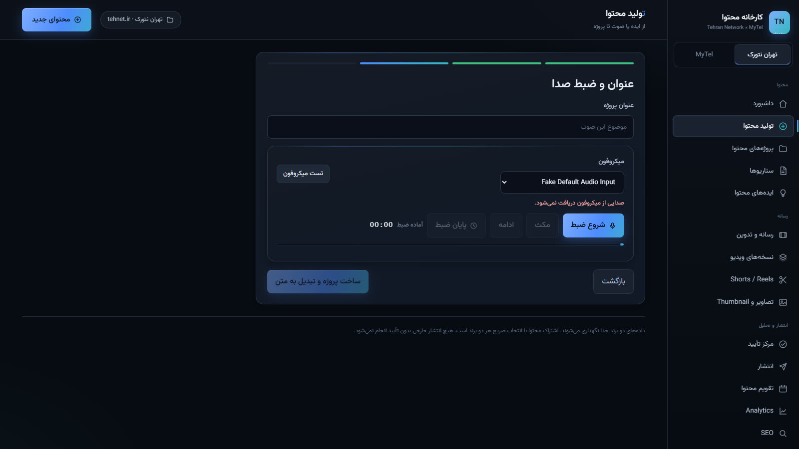
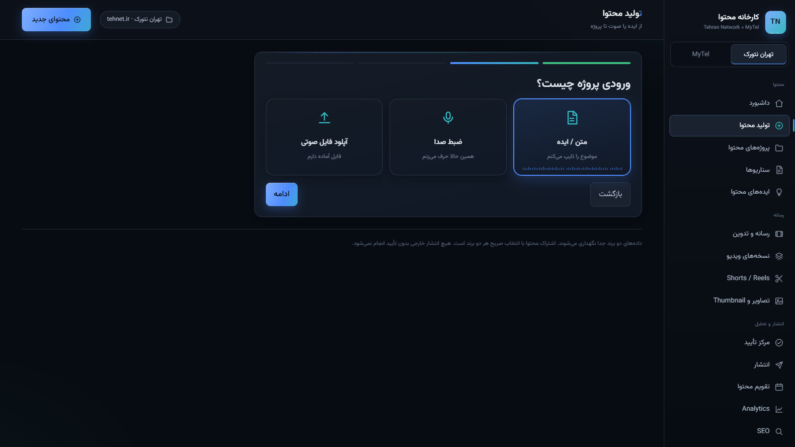

# راهنمای استفادهٔ روزانه (کوتاه و عملی)

> همین صفحه را کنار بگذارید؛ برای جزئیات به [راهنمای کامل](README.fa.md) بروید.

## ۱. روشن‌کردن سیستم
دوبار کلیک روی **`Open-Panel.cmd`** ← مرورگر روی `http://127.0.0.1:8766` باز می‌شود (اگر پورت اشغال باشد: `8767`).
(اولین بار روی سیستم جدید: `setup\Setup-TolidMohtava.ps1` و مطمئن شوید LM Studio روشن است.)

## ۲. ساخت محتوا از ویس
1. «+ محتوای جدید» (نوار بالا) ← برند ← **ضبط صدا**: میکروفون را انتخاب کنید، «تست میکروفون» را بزنید تا «میکروفون فعال است» را ببینید، ضبط کنید (نوار سطح را زیر نظر داشته باشید)، بشنوید و «تأیید و ادامه» ← عنوان ← ساخت. آپلود فایل هم اعتبارسنجی صدا دارد.


2. سیستم خودش تبدیل به متن می‌کند (صف «کارها» پیشرفت را نشان می‌دهد).
3. در صفحهٔ پروژه، تب **هوش مصنوعی** ← «خط تولید کامل» ← تحقیق، بررسی فنی، سناریو، هوک و بسته‌ها ساخته می‌شود.
4. سناریوی موردنظر ← «ثبت به‌عنوان سناریوی پروژه» ← سپس **تأیید سناریو برای ضبط**.



## ۳. آپلود ضبط‌ها
صفحهٔ پروژه ← تب **رسانه** ← فایل فیس‌کم/صفحه/صدای جدا را آپلود کنید ← «همگام‌سازی خودکار تراک‌ها» (اگر گفت «نیاز به بازبینی»، افست دستی بدهید یا صداً چک کنید) ← در صورت نیاز «بهبود صوت».

## ۴. بازبینی تدوین خودکار و بازگردانی برش
تب **تدوین** ← «تحلیل تدوین» ← گزارش فارسی با زمان‌ها را ببینید:
- هر برش حذف‌شده دکمهٔ **بازگردانی** دارد (حتی بعد از تحلیل دوباره می‌ماند).
- موارد «نیاز به بررسی» را خودتان حذف/نگه‌داری کنید.
- کلیک روی هر زمان، ویدیو را همان لححه می‌برد.


## ۵. خروجی نهایی
تب تدوین ← **ساخت Preview** (بازبینی سریع) ← **ساخت نسخهٔ نهایی** ← به «مرکز تأیید» می‌رود ← تأیید کنید ← FINAL ساخته می‌شود (با GPU اگر موجود باشد).

## ۶. Shorts
تب **Shorts** ← «رتبه‌بندی هوشمند V2» ← ۲–۳ کاندیدا با زاویه‌های متفاوت ← روی هر کدام «رندر این کاندیدا».


## ۷. مقاله و سئو
تب **هوش مصنوعی** ← «مقاله و سئو» (از متن واقعی ضبط) ← خروجی با عنوان/متا/slug/کلمات کلیدی.
سئوی کل سایت: صفحهٔ **سئو** ← «اجرای اسکن» ← مشکل‌ها با راه‌حل ← «ساخت پیشنهادهای اصلاح».

## ۸. تأیید انتشار
1. پروژه را نهایی کنید ← **مرکز تأیید** ← «تأیید انتشار» ← بستهٔ dry-run ساخته می‌شود (پیش‌نمایشِ چیزی که منتشر می‌شد؛ فعلاً ارسال واقعی فقط با Credential شما).
2. پیش‌نویس وردپرس: صفحهٔ **انتشار** ← «درخواست پیش‌نویس» (بعد از دادن Application Password).

## ۹. Analytics و برنامه‌ریز
- **Analytics**: وضعیت صادقانهٔ پلتفرم‌ها؛ عملکرد واقعی هر انتشار را با دکمهٔ «ثبت رکورد پایه» وارد کنید تا زمان‌بندی تطبیقی و پیشنهادها از دادهٔ خودتان شروع کنند.
- **برنامه‌ریز**: صفحهٔ «ایده‌های محتوا» ← «ساخت برنامهٔ هفته» (هر پیشنهاد با دلیل و میزان اطمینان).

## ۱۰. پشتیبان‌گیری
```powershell
powershell -ExecutionPolicy Bypass -File setup\Backup-TolidMohtava.ps1
```
(فایل‌های حجیم RAW فقط با `-IncludeMedia`.)

## ۱۱. خاموش‌کردن امن
پنجرهٔ `server` را ببندید (یا Ctrl+C). دیتابیس و تاریخچهٔ کارها باقی می‌ماند؛ دوباره `Open-Panel.cmd`.
همیشه قبل از خاموشیِ طولانی، پشتیبان بگیرید.


## حذف/آرشیو پروژه
در فهرست پروژه‌ها، منوی «⋯» هر ردیف: تغییر نام / **آرشیو** (پیشنهادی؛ حفظ کامل) / **حذف** (باید کلمهٔ «حذف» را تایپ کنید). پست‌های بیرونی هرگز حذف نمی‌شوند.
پروژه‌های آرشیوشده با دکمهٔ **«نمایش آرشیو»** در صفحهٔ پروژه‌ها ظاهر می‌شوند و با **«بازگردانی از آرشیو»** به فهرست فعال برمی‌گردند.
