# راهنمای اولین اجرا (FIRST-RUN) — از صفر تا اولین محتوای کامل

> همهٔ تصاویر واقعی از رابط v2 است. حدود ۱۵ دقیقه برای اولین محتوا کافی است.

## ۱. اجرا ← ۲. داشبورد
دوبار کلیک روی `Open-Panel.cmd` ← مرورگر روی `http://127.0.0.1:8766`.
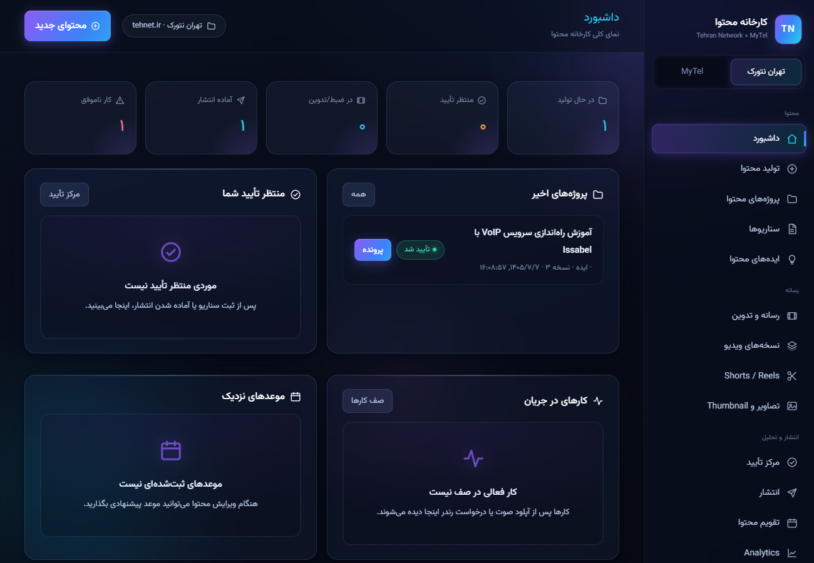
*اگر همه‌چیز خالی است طبیعی است — عدد نمونه نداریم. از دکمهٔ بنفش شروع کنید.*

## ۳. محتوای جدید ← ۴. انتخاب برند و ورودی
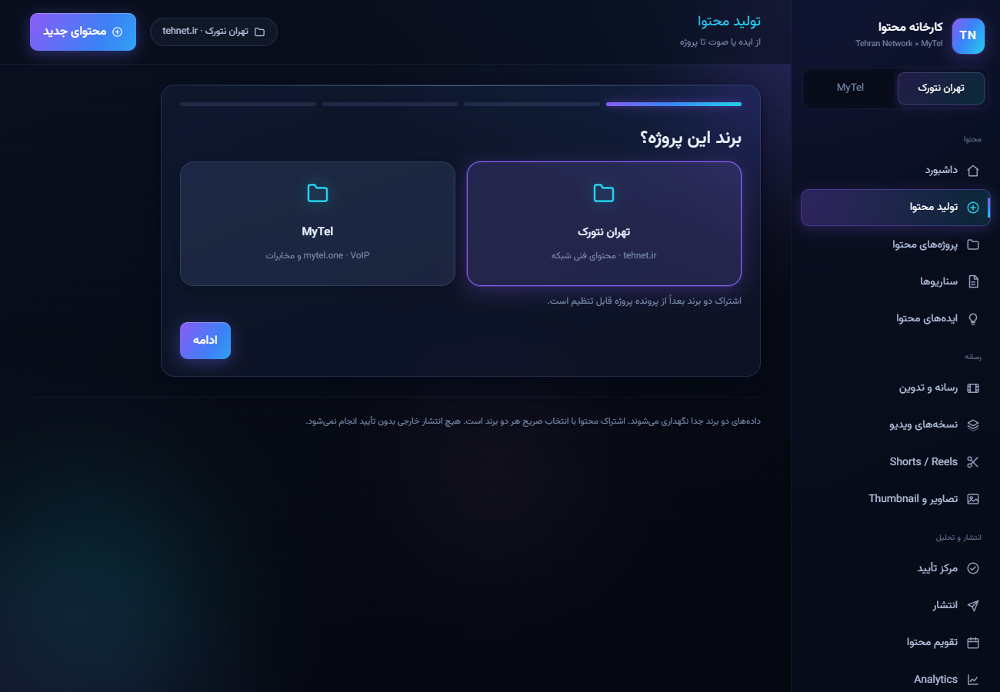
«تهران نتورک» ← کارت **«ضبط صدا»** ← «شروع ضبط»، چند جملهٔ فارسی دربارهٔ ایده‌تان بگویید، «پایان ضبط» ← عنوان بنویسید ← «ساخت پروژه و تبدیل به متن».

## ۵. Transcript خودکار
پیشرفت تبدیل در «کارها»؛ متن با زمان‌بندی در تب Transcript:
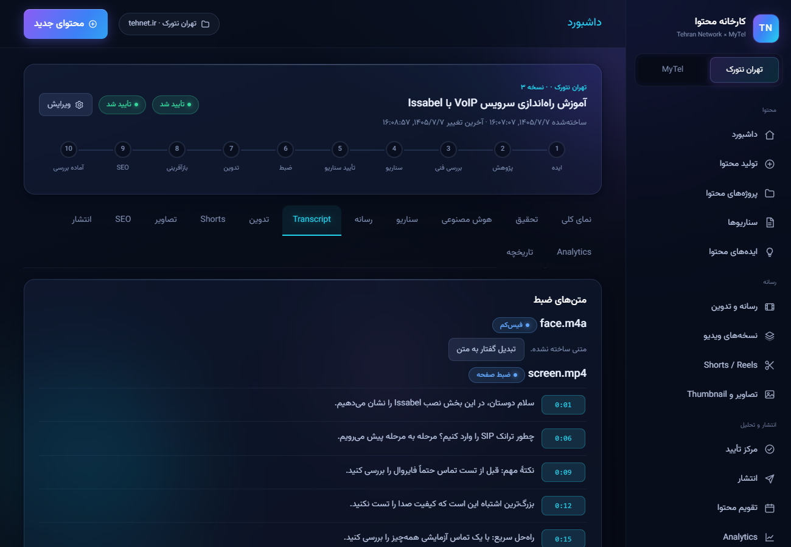

## ۶. تحقیق ← ۷. سناریو
تب **هوش مصنوعی** ← «خط تولید کامل» ← صبر تا سبز شود؛ خروجی‌ها (تحقیق، سناریو، هوک، بسته‌ها) همان‌جا:
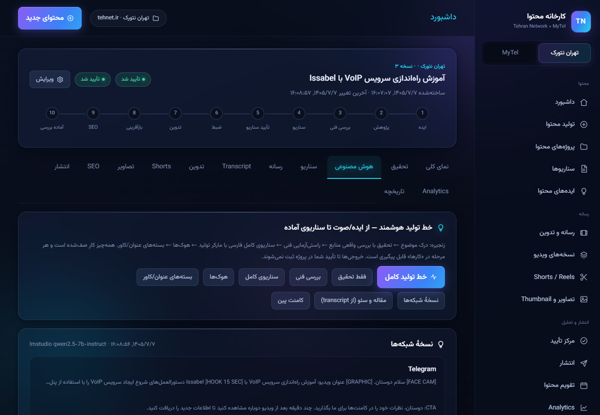
سناریوی خوب؟ «ثبت به‌عنوان سناریوی پروژه» ← تب سناریو ← «تأیید سناریو برای ضبط».
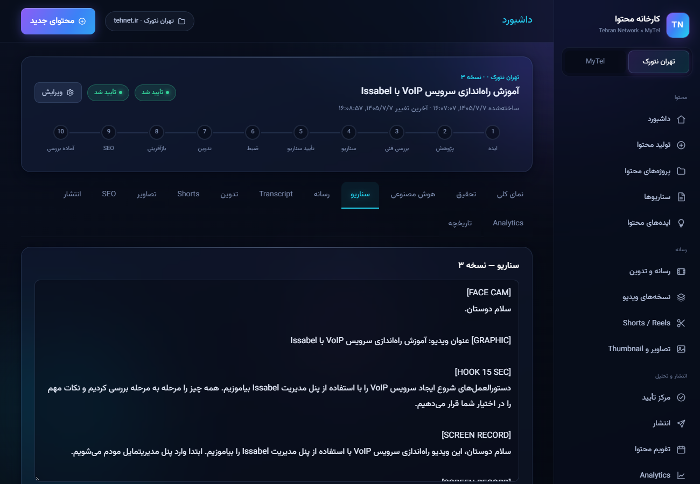

## ۸. آپلود ضبط‌ها ← ۹. تدوین خودکار
تب **رسانه** ← فایل فیس‌کم و ضبط صفحه را بدهید ← «همگام‌سازی خودکار تراک‌ها».
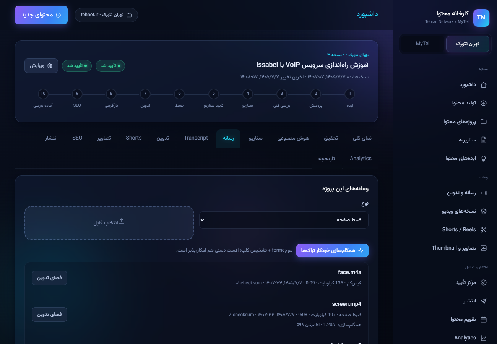
تب **تدوین** ← «تحلیل تدوین» ← گزارش را ببینید؛ هر برش اشتباه را «بازگردانی» کنید:
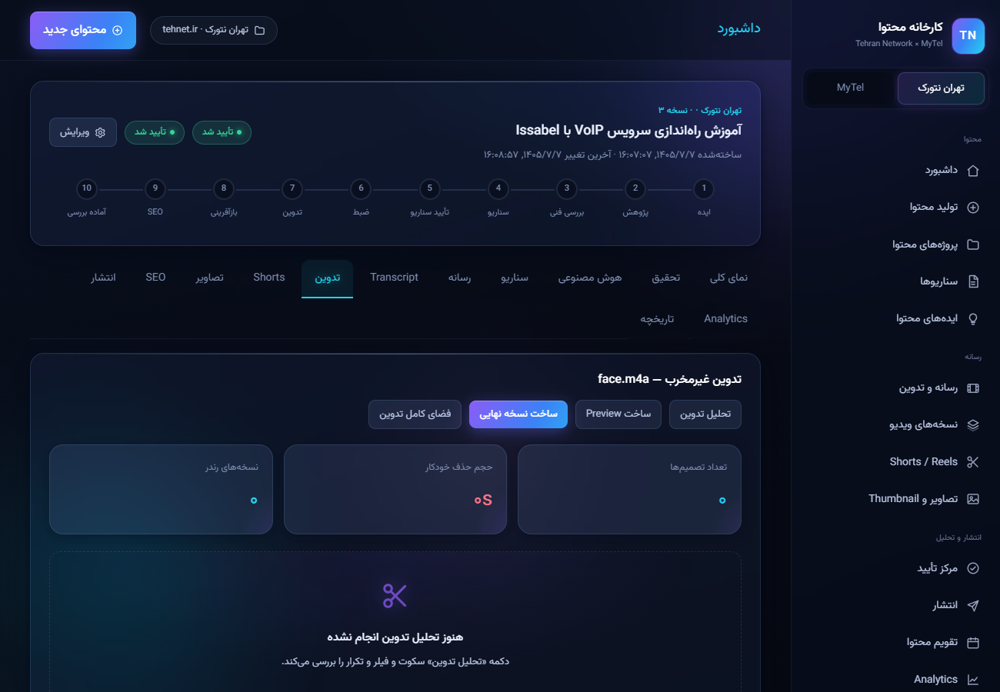

## ۱۰. Preview ← ۱۱. Final
«ساخت Preview» ← پخش کنترل کنید ← «ساخت نسخهٔ نهایی» ← **مرکز تأیید** ← تأیید:
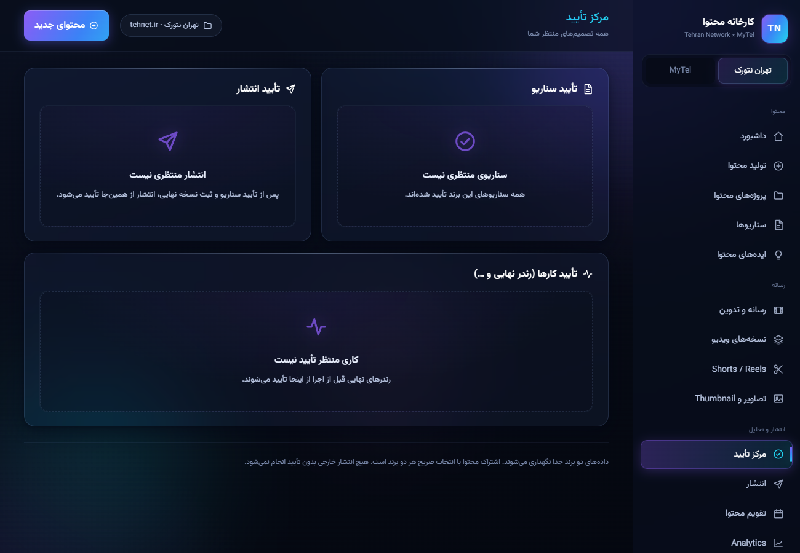

## ۱۲. Shorts ← ۱۳. مقاله و سئو
تب Shorts ← «رتبه‌بندی هوشمند V2» ← «رندر این کاندیدا».
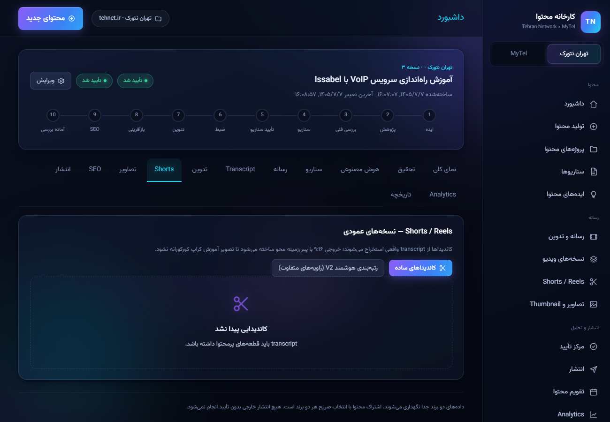
تب هوش مصنوعی ← «مقاله و سئو»؛ صفحهٔ سئو ← «اجرای اسکن».
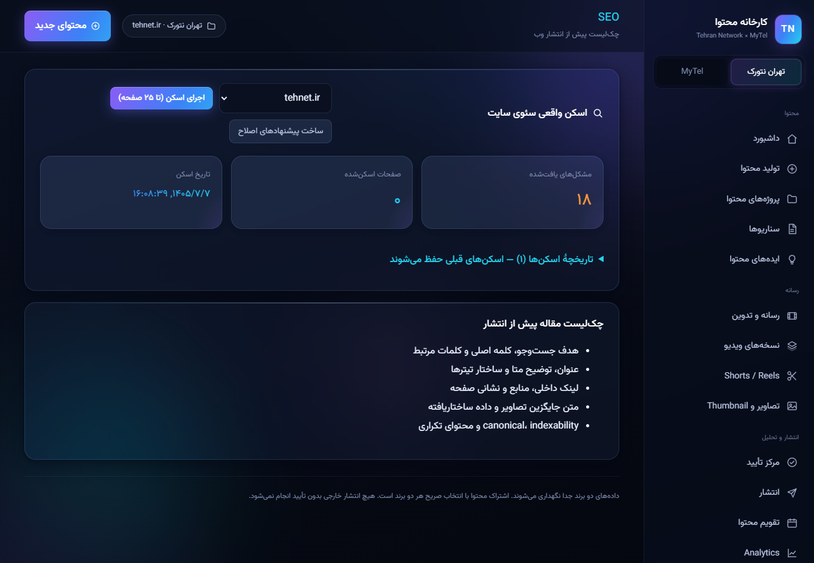

## ۱۴. تأیید انتشار (Dry-Run) ← ۱۵. Analytics
مرکز تأیید ← «تأیید انتشار» ← بستهٔ dry-run در صفحهٔ انتشار:
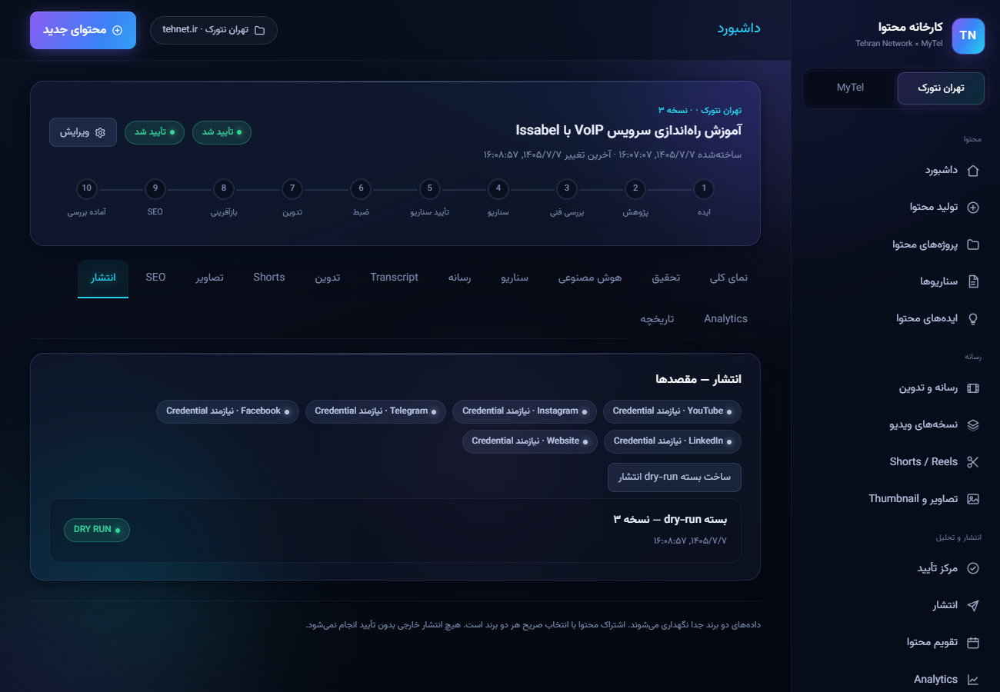
عملکرد واقعی را در Analytics ثبت کنید تا یادگیری شروع شود:
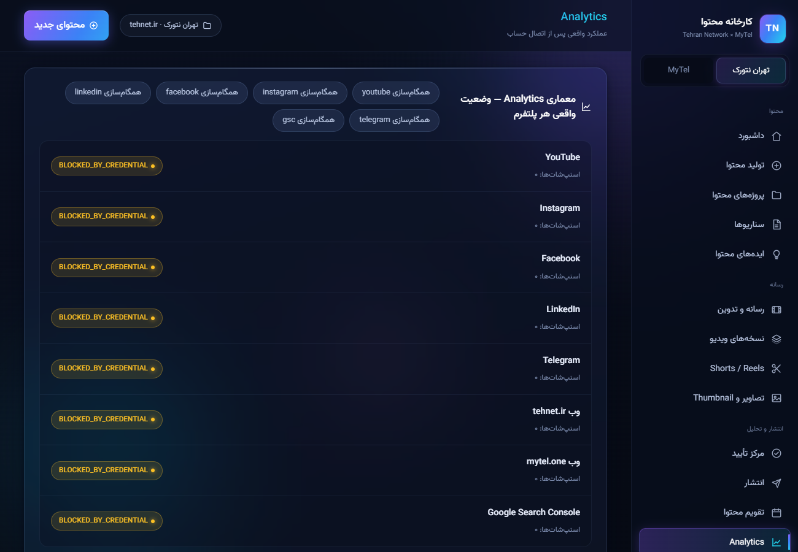

**تمام!** از این‌جا به بعد روزانه فقط: [DAILY-USE](DAILY-USE.fa.md) · همهٔ دکمه‌ها: [UI-GUIDE](UI-GUIDE.fa.md)
