# راهنمای کامل کارخانهٔ محتوای تهران نتورک و MyTel (فارسی)

این راهنما برای **شما به‌عنوان کاربر نهایی** نوشته شده — نه برنامه‌نویس. هر بخش می‌گوید چه چیزی کجاست و چه کلیکی چه کاری می‌کند. تصاویر، تصاویر واقعی همین پنل با دادهٔ واقعی آزمون‌اند.

> راهنمای سریع: [QUICKSTART](QUICKSTART.fa.md) · نصب: [INSTALLATION](INSTALLATION.fa.md) · انتقال به سیستم دیگر: [MIGRATION](MIGRATION.fa.md) · فهرست قابلیت‌ها: [FEATURES](FEATURES.fa.md)

---

## ۱. این پروژه چیست؟

یک **کارخانهٔ محتوای محلی** روی کامپیوتر شما: ایدهٔ فارسی می‌دهید (تایپ یا گفتن)، سیستم خودش تبدیل به متن می‌کند، تحقیق و راستی‌آزمایی فنی می‌کند، سناریوی کامل می‌نویسد، هوک و عنوان و کاور پیشنهاد می‌دهد؛ بعد از ضبط شما، صداها را همگام می‌کند، تپق و سکوت را بی‌خطر پیدا و قابل بازگردانی حذف می‌کند، خروجی می‌سازد، Shorts استخراج می‌کند، مقالهٔ سئو و پست هر شبکه را می‌نویسد — و **هیچ‌چیز بدون تأیید شما جایی منتشر نمی‌شود**.

- **تهران نتورک** (tehnet.ir) و **MyTel** (mytel.one) دو فضای کاری کاملاً جدا هستند.
- همهٔ داده‌ها (دیتابیس، رسانه، خروجی‌ها) فقط روی همین سیستم می‌ماند.
- فایل‌های اصلی ضبط (RAW) **هرگز** تغییر یا حذف نمی‌شوند.

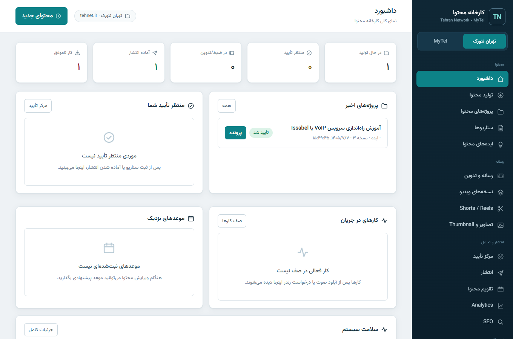
*داشبورد — وضعیت واقعی: در حال تولید، منتظر تأیید شما، کارهای در جریان و سلامت سیستم. عددی نمایش داده نمی‌شود که واقعی نباشد.*

## ۲. شروع: نصب و اجرا

ساده‌ترین راه: مخزن را Clone کنید، سپس دوبار کلیک روی **`Open-Panel.cmd`**. اگر ویندوز تازه‌ای است، یک‌بار `setup\Setup-TolidMohtava.ps1` را اجرا کنید (Python/FFmpeg نبود را خودش نصب می‌کند؛ دوباره اجرا بی‌خطر است). جزئیات کامل: [INSTALLATION](INSTALLATION.fa.md).

پنل آدرسش `http://127.0.0.1:8766` است و **فقط روی همین کامپیوتر** در دسترس است.

## ۳. ساخت اولین پروژهٔ محتوا (ویزارد «تولید محتوا»)

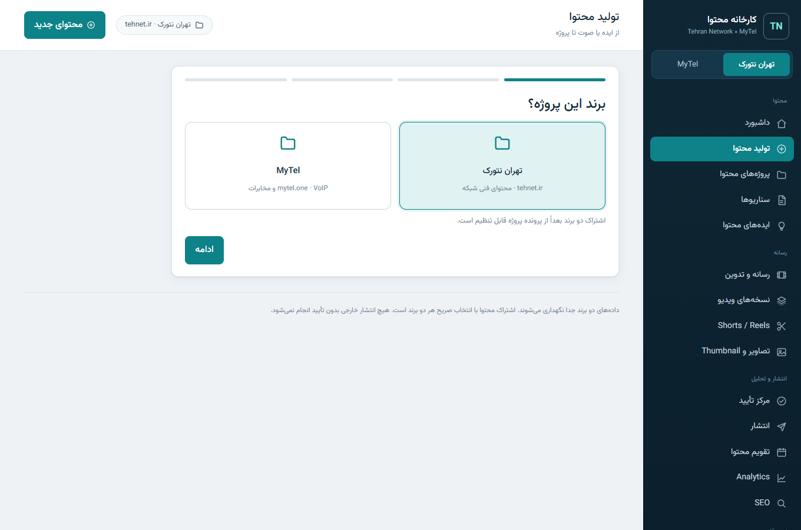
*ویزارد ۴ مرحله‌ای: برند ← نوع ورودی ← موضوع ← ساخت. سه راه ورودی: تایپ، ضبط مستقیم صدای خودتان، یا آپلود فایل صوتی.*

1. دکمهٔ **«+ محتوای جدید»** (بالا) → ویزارد باز می‌شود.
2. برند را انتخاب کنید (تهران نتورک یا MyTel).
3. نوع ورودی: **متن/ایده**، **ضبط صدا** (میکروفون) یا **آپلود فایل صوتی**.
4. عنوان بنویسید؛ اگر صوت دادید، تبدیل گفتار به متن خودکار (فارسی، روی کارت گرافیک) اجرا و متن با timestamp ذخیره می‌شود.

## ۴. ویس دادم — بعدش چه می‌شود؟ (مسیر هوشمند)

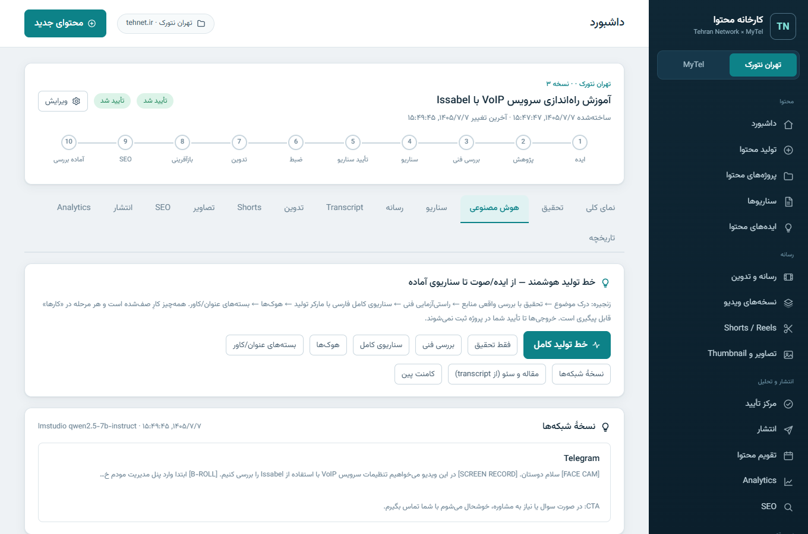
*تب «هوش مصنوعی» در صفحهٔ پروژه: با یک کلیک «خط تولید کامل» اجرا می‌شود.*

در تب **هوش مصنوعی** پروژه:
- **خط تولید کامل**: تحقیق → راستی‌آزمایی فنی → سناریوی کامل → هوک‌ها → بسته‌های عنوان/کاور. همه به‌صورت کارِ صف‌شده با پیشرفت زنده.
- خروجی هر مرحله همان‌جا نمایش داده می‌شود؛ سناریوی راضی‌کننده را با «ثبت به‌عنوان سناریوی پروژه» ذخیره کنید (نسخهٔ جدید؛ تأیید قبلی باطل می‌شود).

### تحقیق و منابع
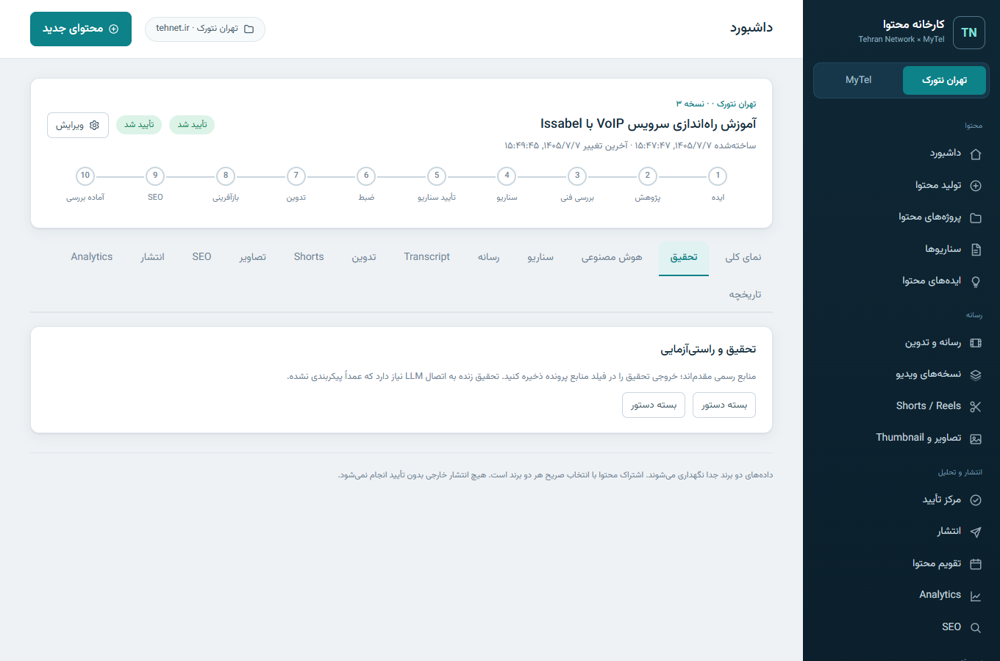
*خروجی تحقیق: نکته‌های کلیدی، ادعاهای فنی، و وضعیت واقعی هر منبع — «زنده» یا «نیاز به بررسی».*

هر نشانی منبع **واقعاً بررسی می‌شود** (درخواست HTTP واقعی). منبعی که پاسخ ندهد، صادقانه «نیاز به بررسی» می‌ماند؛ هیچ منبع جعلی ساخته نمی‌شود. منابع در پرونده ذخیره می‌شوند و در تب «منابع» پنل دیده می‌شوند.

## ۵. سناریو کجاست و تأیید چطور؟

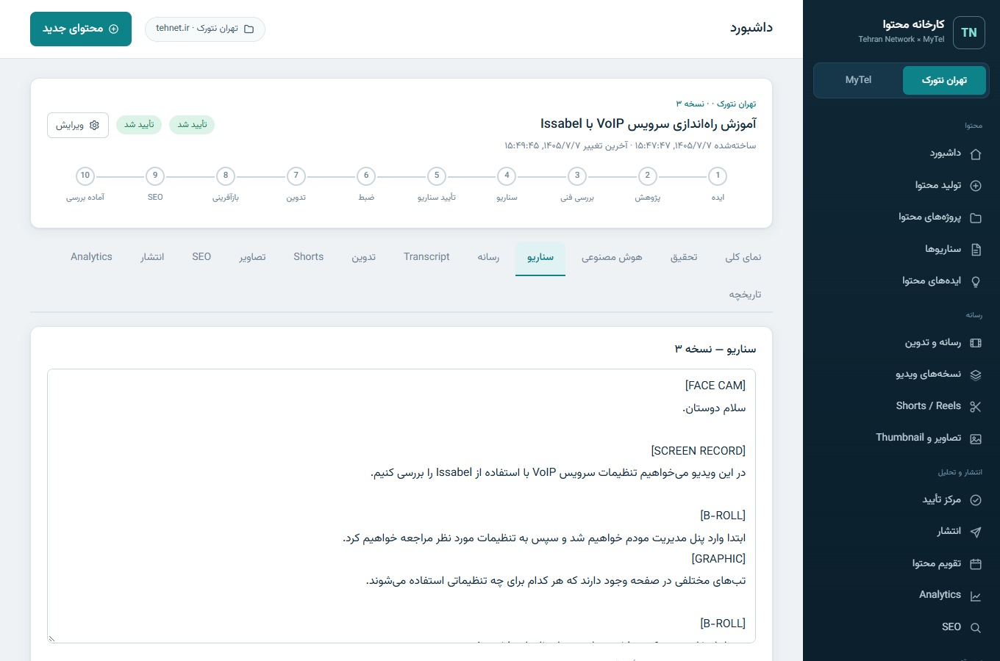
*تب سناریو: متن قابل ویرایش، ذخیرهٔ نسخهٔ جدید، و دکمهٔ «تأیید سناریو برای ضبط».*

- هر ذخیره یک **نسخهٔ جدید** می‌سازد؛ تاریخچه از بین نمی‌رود.
- **تأیید سناریو** یعنی «برای ضبط آماده است». تأیید انتشار جدا است.
- مرکز تأیید همهٔ موارد منتظر تصمیم شما را یک‌جا نشان می‌دهد:
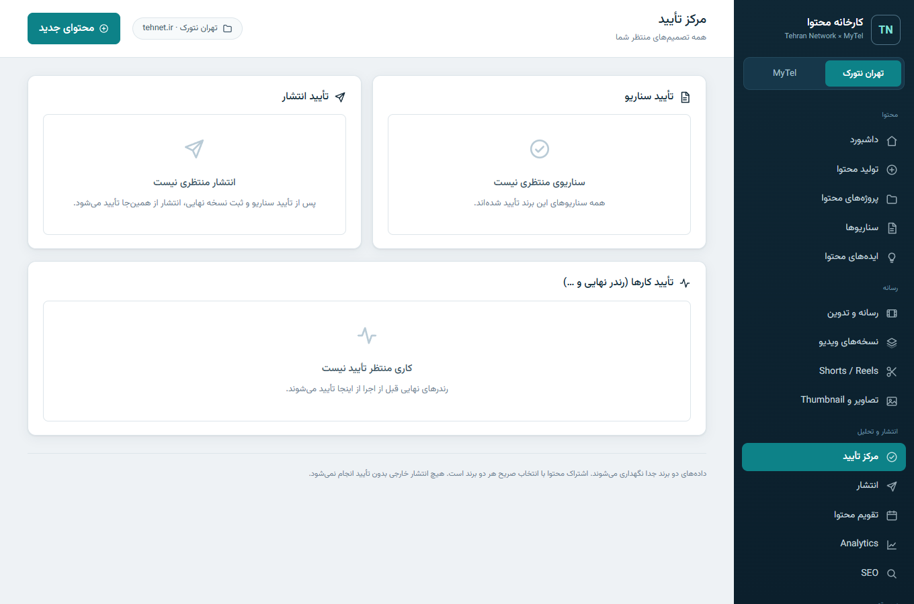
*تأیید سناریو، تأیید انتشار و کارهای منتظر تأیید (مثل رندر نهایی) با دکمه‌های تأیید/رد/نیاز به اصلاح.*

## ۶. فایل ضبط را چطور وارد کنم؟ (رسانه و تدوین)

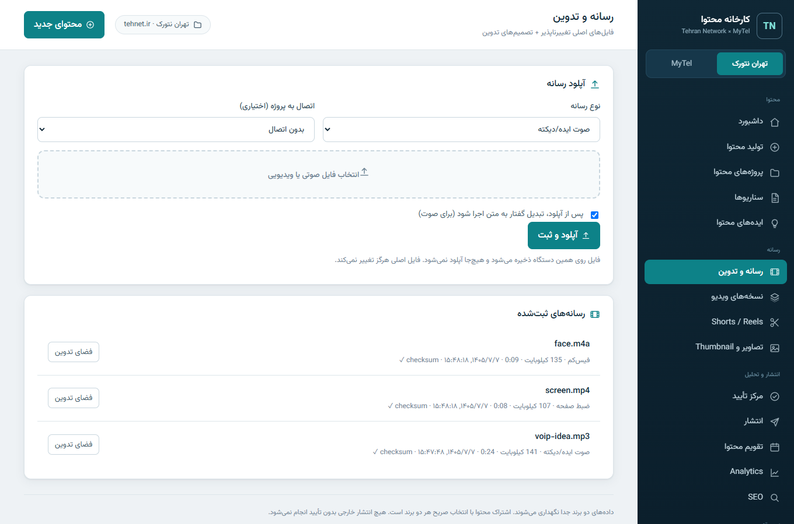
*آپلود تغییرناپذیر: ضبط صفحه، فیس‌کم، صدای جدا. فایل اصلی هرگز دست نمی‌خورد؛ همهٔ حذف‌ها فقط «تصمیم» ثبت می‌شوند.*

در صفحهٔ پروژه → تب **رسانه**، فایل‌ها را آپلود کنید (تا ۲۰ گیگابایت). سپس:
- **همگام‌سازی خودکار تراک‌ها**: فیس‌کم و ضبط صفحه با همبستگی موج صدا همگام می‌شوند؛ اگر اطمینان پایین باشد، صادقانه «نیاز به بازبینی» می‌شود و می‌توانید افست دستی بدهید.
- **بهبود صوت**: نسخهٔ بهبودیافتهٔ جدید می‌سازد (نویزگیر ملایم + نرمال‌سازی)؛ صدای طبیعی شما مصنوعی نمی‌شود.

## ۷. تدوین خودکار و بازگردانی Cut

تحلیل تدوین سکوت‌های بلند، حذف فیلرهای واضح («اِ»، «اِم») و تکرارها را پیدا می‌کند:
- موارد واضح: حذف خودکار (ولی فقط «تصمیم» — فایل اصلی سالم است).
- موارد مشکوک: فقط «نیاز به بررسی»؛ هرگز خودکار حذف نمی‌شود.
- هر برش دکمهٔ **بازگردانی** دارد؛ بازگردانی حتی بعد از تحلیل مجدد هم می‌ماند.
- گزارش فارسی با زمان دقیق (مثل `۱۳:۲۴–۱۳:۲۸ سکوت طولانی حذف شد`) و کلیک روی هر زمان، ویدیو را همان‌جا می‌برد.

## ۸. خروجی نهایی و Shorts

- **ساخت Preview**: خروجی سریع برای بازبینی.
- **ساخت نسخهٔ نهایی**: اول به مرکز تأیید می‌رود؛ بعد از تأیید شما ساخته می‌شود (با کدگذاری NVENC کارت گرافیک در صورت موجود بودن).
- نسخه‌ها: `EDIT V1…Vn` و `FINAL` — همه در تب «نسخه‌های ویدیو» قابل پخش.

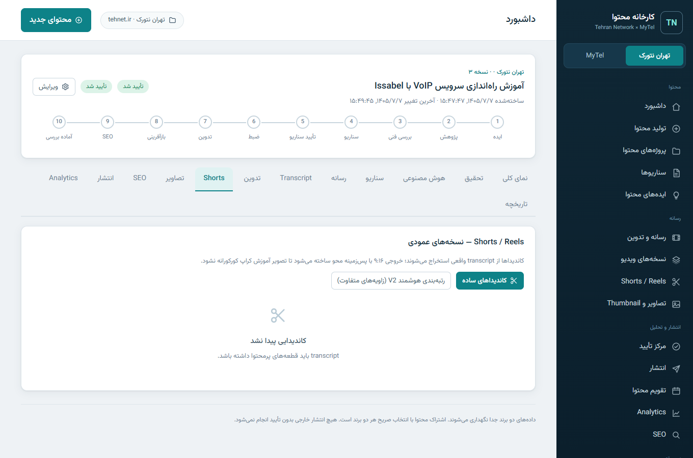
*Shorts: کاندیداهای هوشمند با زاویه‌های متفاوت (آموزشی/اشتباه/نکته)؛ قبل از رندر، هر کاندیدا را می‌بینید و همان را که خواستید رندر می‌کنید.*

## ۹. مقاله، سئو و انتشار

- **مقاله و سئو**: از متن واقعی ضبط، مقالهٔ وب (نه کپی transcript) با عنوان سئو، متا، slug و کلمات کلیدی ساخته می‌شود.
- **سئوی سایت**: صفحهٔ سئو سایت واقعی tehnet.ir و mytel.one را می‌خزد (محدود و مؤدبانه) و مشکل‌ها را با راه‌حل مشخص فهرست می‌کند؛ تاریخچهٔ اسکن‌ها نگه داشته می‌شود.
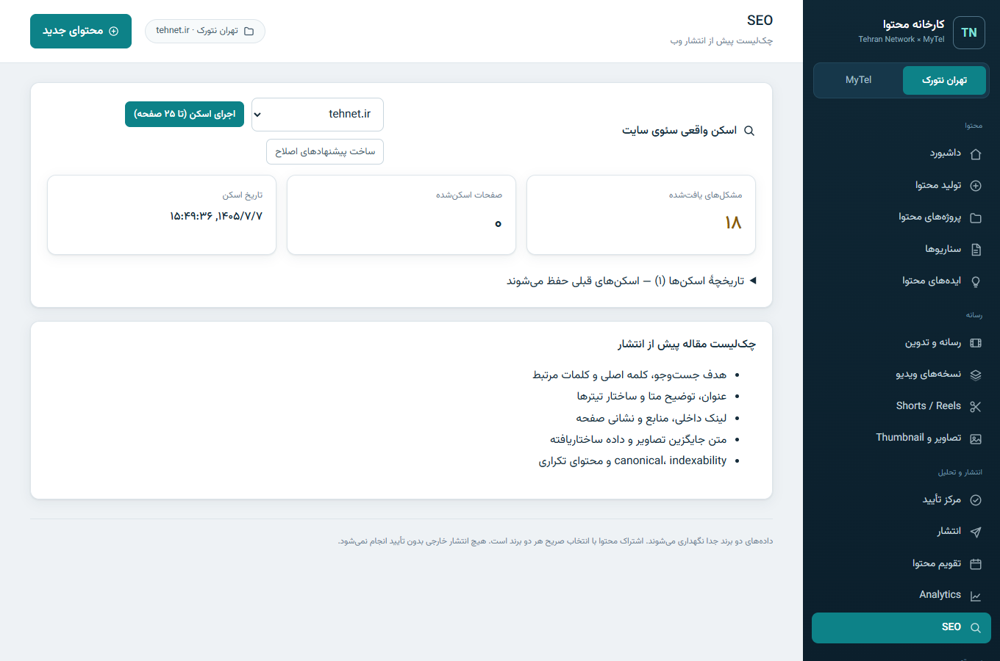
- **انتشار**: فعلاً فقط «بستهٔ dry-run» — دقیقاً می‌بینید چه چیزی کجا منتشر می‌شد، بدون هیچ ارسال واقعی. پیش‌نویس وردپرس آماده است و به‌محض دادن Application Password فعال می‌شود.

## ۱۰. Analytics، برنامه‌ریز و یادگیری

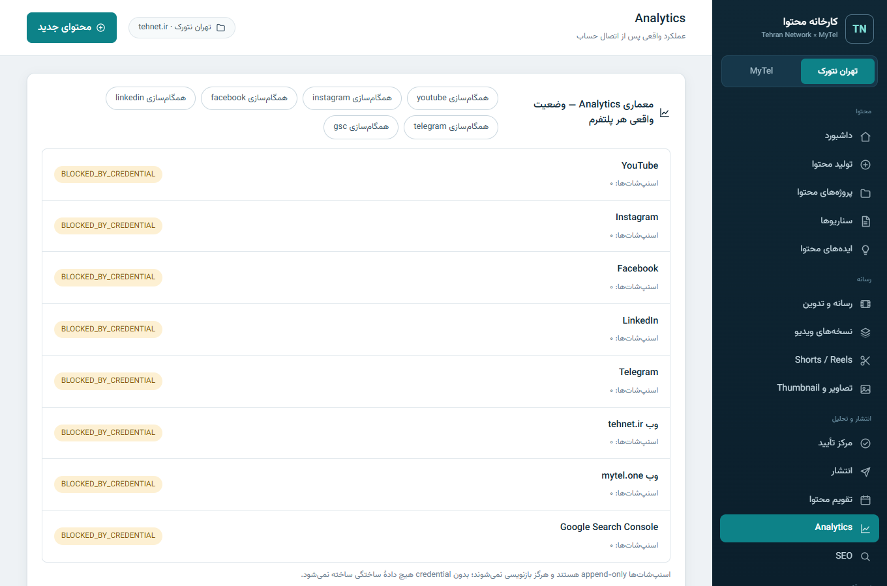
*معماری Analytics: وضعیت صادقانهٔ هر پلتفرم، زمان‌بندی تطبیقی (BASELINE تا داده کافی برسد)، و پیشنهادهای بهینه‌سازی با تأیید شما.*

- بدون اتصال حساب، **هیچ نمودار ساختگی** نیست؛ می‌توانید عملکرد واقعی انتشارها را دستی ثبت کنید تا موتور یادگیری از همان شروع کند.
- **زمان‌بندی تطبیقی**: اول پیشنهاد پایه؛ بعد از ~۸ انتشار واقعی، از دادهٔ خودتان بهترین روز/ساعت را با «چرا» و «شواهد» پیشنهاد می‌کند.
- **پیشنهادهای بهینه‌سازی** (عنوان/کاور/CTA) فقط پیشنهاد می‌دهند؛ اعمالشان تأیید شما می‌خواهد.

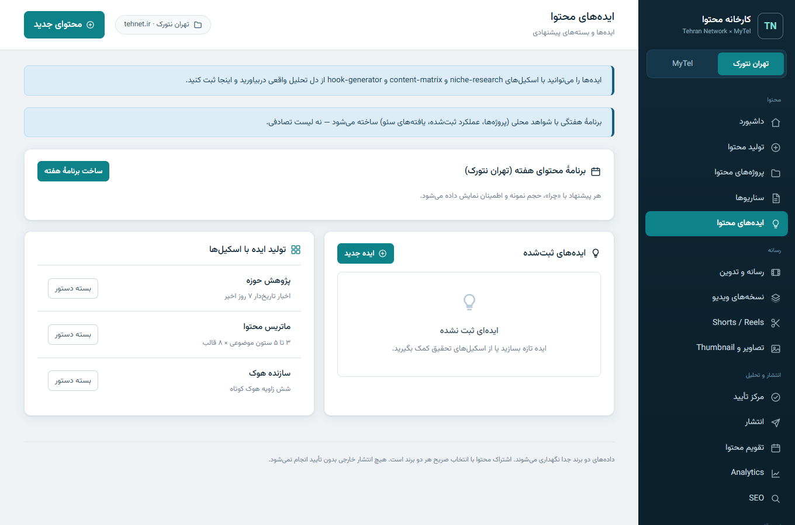
*برنامهٔ هفتگی با شواهد محلی: هر پیشنهاد «چرا»، حجم نمونه و میزان اطمینان دارد.*

## ۱۱. کارها (Jobs) و اعلان‌ها

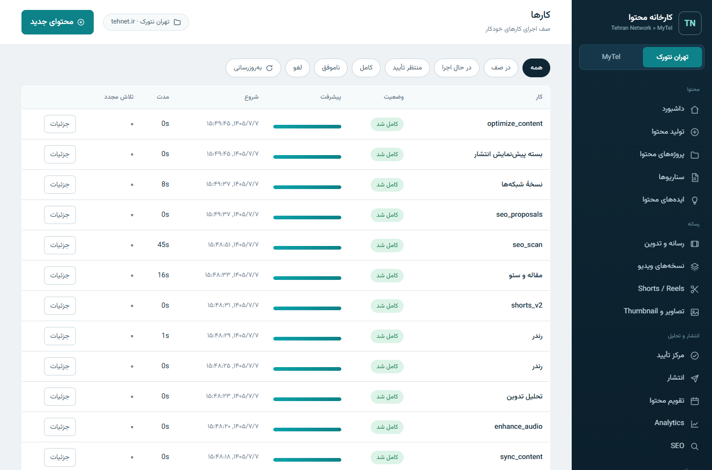
*صف کارها: پیشرفت زندهٔ هر کار (تبدیل/تحلیل/رندر/سئو)، فیلتر وضعیت، لاگ اجرا، تلاش دوباره و لغو. تاریخچه پس از بستن پنل می‌ماند.*

اعلان‌های معنادار (نیاز به تأیید، شکست کار، تکمیل رندر) در صفحهٔ اعلان‌ها ثبت می‌شوند؛ Telegram با دادن توکن فعال می‌شود.

## ۱۲. Credentialها را کجا وارد کنم؟ (اتصال حساب‌ها)

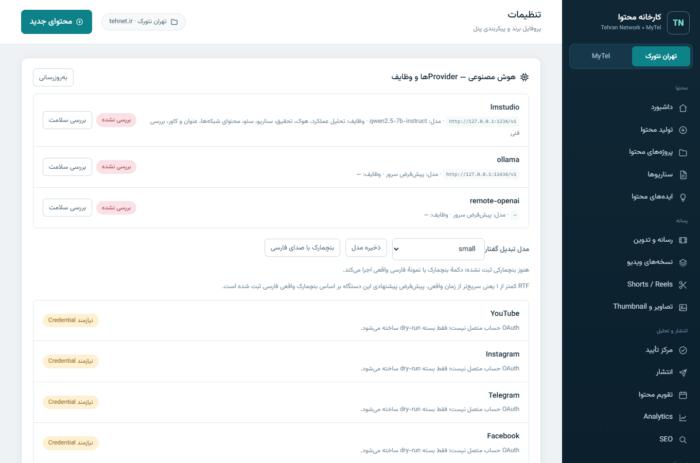
*تنظیمات ← اتصال حساب‌ها: برای هر سرویس، scope لازم، نام متغیر محیطی، راهنمای گام‌به‌گام و دکمهٔ «تست اتصال» واقعی. مقدار Secret هرگز نمایش یا ذخیره نمی‌شود.*

جدول کامل متغیرها در [.env.example](../.env.example) است. خلاصه:
| سرویس | متغیرها | محل دریافت |
|---|---|---|
| وردپرس tehnet.ir / mytel.one | `WP_TEHNET_USER`+`WP_TEHNET_APP_PASSWORD` (و مشابه MYTEL) | وردپرس ← کاربران ← Application Passwords |
| Telegram | `TELEGRAM_BOT_TOKEN`+`TELEGRAM_CHAT_ID` | @BotFather و @userinfobot |
| YouTube / Instagram / Facebook / LinkedIn | متغیرهای OAuth هر پلتفرم | کنسول توسعه‌دهندهٔ همان پلتفرم |
| GA4 / GSC / Keyword Planner | `GA4_*` / `GSC_CREDENTIALS` / `GOOGLE_ADS_*` | Google Cloud |
| Gemini (تولید تصویر) | `GOOGLE_AI_API_KEY` | Google AI Studio |

## ۱۳. فضای ذخیره‌سازی و My Passport

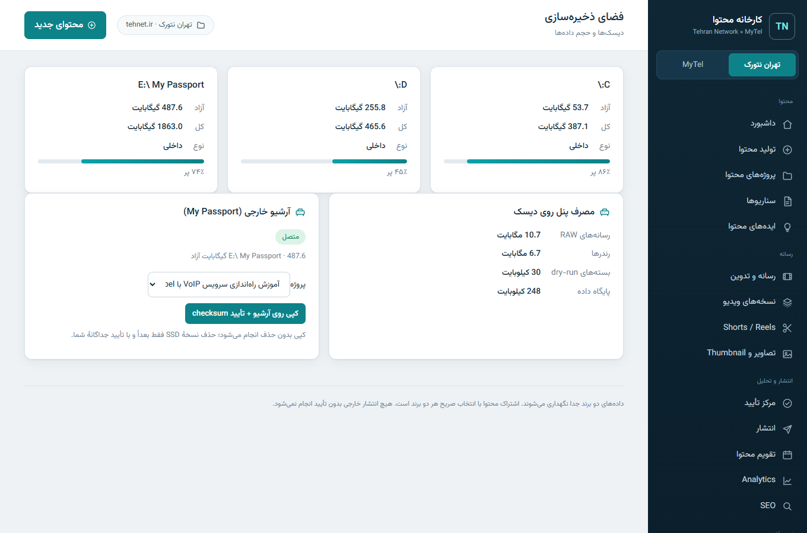
*دیسک‌های واقعی، مصرف پنل، و وضعیت My Passport — «کپی روی آرشیو + تأیید checksum» با تأیید شما؛ حذف نسخهٔ اصلی همیشه تأیید جداگانه می‌خواهد.*

## ۱۴. سلامت سیستم و عیب‌یابی

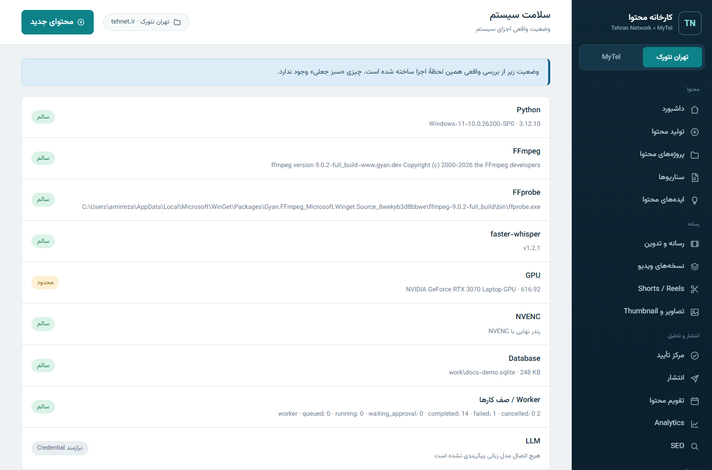
*وضعیت واقعی اجزا (نه سبز جعلی) + آزمون GPU واقعی. اگر چیزی وصل نیست، همان‌جا می‌گوید چرا و چه کنید.*

خطاهای رایج:
| نشانه | راه‌حل |
|---|---|
| صفحهٔ راهنما هنگام باز کردن فایل | `Open-Panel.cmd` را اجرا کنید؛ فایل HTML را مستقیم باز نکنید |
| «BLOCKED_BY_CREDENTIAL» | Credential مربوطه را در environment بگذارید (بخش ۱۲) |
| تبدیل گفتار کند/بدون GPU | سلامت سیستم ← آزمون GPU؛ در صورت خطا خودکار CPU می‌شود |
| LM Studio پاسخ نمی‌دهد | `lms server start` سپس `lms load qwen2.5-7b-instruct --gpu max` |

## ۱۵. پشتیبان‌گیری و انتقال

- پشتیبان: `setup\Backup-TolidMohtava.ps1` (با `-IncludeMedia` برای فایل‌های RAW).
- بازیابی امن: `setup\Restore-TolidMohtava.ps1 -From <پوشه>` (هرگز بی‌اجازه بازنویسی نمی‌کند).
- انتقال کامل به کامپیوتر جدید: [MIGRATION](MIGRATION.fa.md).

## ۱۶. حریم خصوصی برندها

تهران نتورک برند اصلی آموزشی است؛ MyTel فقط در محتوای VoIP و به‌صورت زمینه‌ای معرفی می‌شود. دربارهٔ PVNetwork هیچ رابطهٔ مالکیتی/رسمی‌ای ادعا یا استنباط نمی‌شود.
