# راهنمای دکمه‌به‌دکمهٔ رابط کاربری (UI-GUIDE)

> همهٔ تصاویر از رابط واقعی نسخهٔ v3 با دادهٔ واقعی آزمون گرفته شده‌اند. شماره‌گذاری تصاویر پیچیده در پایین هر تصویر توضیح داده شده است.

---

## داشبورد

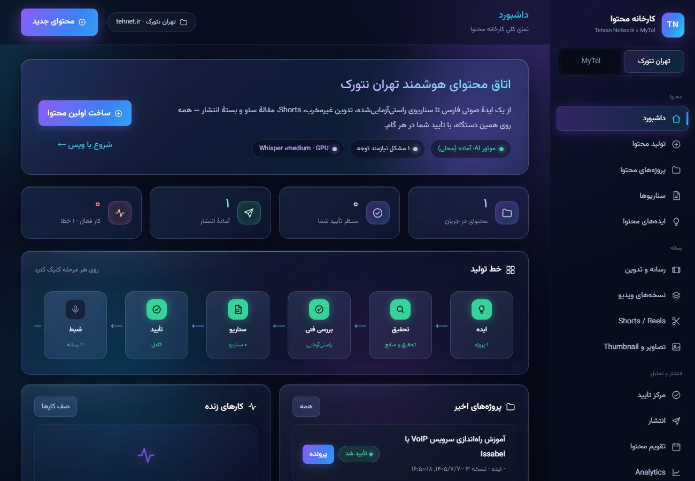

**۱ — سوییچر فضای کاری:** بین «تهران نتورک» و «MyTel» جابه‌جا می‌شود؛ همهٔ فهرست‌ها فقط دادهٔ همان برند را نشان می‌دهند.
**۲ — کارت‌های آمار:** وضعیت واقعی (در حال تولید، منتظر تأیید، کار ناموفق). عدد ساختگی وجود ندارد؛ خالی = صفر واقعی.
**۳ — کارهای در جریان:** پیشرفت زندهٔ تبدیل/تحلیل/رندر با نوار درخشان.
**۴ — خط تولید (Pipeline):** مسیر ایده تا Analytics به‌صورت زنجیره؛ روی هر حلقه hover کنید برون‌تاب بنفش می‌گیرد.
**۵ — سلامت سیستم:** chips وضعیت اجزا؛ «نیازمند Credential» یعنی همان بخش فعلاً بدون کلید شماست.

#### دکمه «+ محتوای جدید» (نوار بالا) / «تولید محتوا» (منوی کنون)
- **کاربرد:** شروع ویزارد ساخت پروژه.
- **کی:** هر بار که ایده/ویس جدید دارید.
- **بعد از کلیک:** ویزارد ۴ مرحله‌ای باز می‌شود (کارد بعدی).
- **تأیید لازم؟** خیر (فقط ثبت محلی).

#### کارت‌های «همه» / «مرکز تأیید» / «صف کارها»
- پرش سریع به همان بخش؛ هیچ تأییدی ثبت نمی‌کنند.

---

## ضبط صدا (میکروفون واقعی)

در ویزارد، حالت «ضبط صدا» یک کارت کامل دارد:

- **میکروفون:** فهرست دستگاه‌های ورودی (بعد از اجازهٔ مرورگر). انتخاب شما محلی ذخیره می‌شود. اگر دستگاه انتخابی در دسترس نباشد پیام می‌گیرید.
- **تست میکروفون:** ۴ ثانیه گوش می‌دهد و «میکروفون فعال است» را فقط وقتی واقعاً سیگنال ببیند می‌گوید؛ وگرنه «صدایی از میکروفون دریافت نمی‌شود.»
- **نوار سطح زنده:** همیشه ضبط، سطح واقعی ورودی را نشان می‌دهد؛ اگر ~۶ ثانیه بی‌صدای مؤثر بماند هشدار «سطح صدای ورودی بسیار پایین است.» می‌آید (ضبط قطع نمی‌شود).
- **دکمه‌ها:** شروع ضبط / مکث / ادامه / پایان ضبط — دابل‌استارت مسدود است.
- **پس از ضبط:** پخش‌کنندهٔ صوت + مدت + دستگاه + زمان؛ «تأیید و ادامه» (بدون آن، ساخت پروژه فعال نمی‌شود)، «ضبط مجدد» (نسخهٔ قبلی حفظ می‌شود) و «حذف ضبط» (با تأیید؛ فقط همین رسانه).
- **INVALID_AUDIO:** اگر فایل بی‌صدا/خالی باشد، ضبط رد می‌شود و Whisper اجرا نمی‌شود؛ گزینه‌ها: ضبط مجدد / میکروفون دیگر / تست / حذف.

## مدیریت پروژه (منوی ⋯)

در هر ردیف پروژه: باز کردن · تغییر نام · **آرشیو** (پیش‌فرض امن؛ همه‌چیز حفظ و از فهرست فعال پنهان) · **حذف پروژه** (دیالوگ شمارش وابستگی‌ها + تایپ «حذف» برای فعال شدن حذف قطعی؛ پروژهٔ منتشرشده هشدار ویژه دارد و پست‌های بیرونی هرگز حذف نمی‌شوند).
پروژه‌های آرشیوشده با دکمهٔ **«نمایش آرشیو»** در صفحهٔ پروژه‌ها دیده می‌شوند و از همان‌جا با **«بازگردانی از آرشیو»** برمی‌گردند.

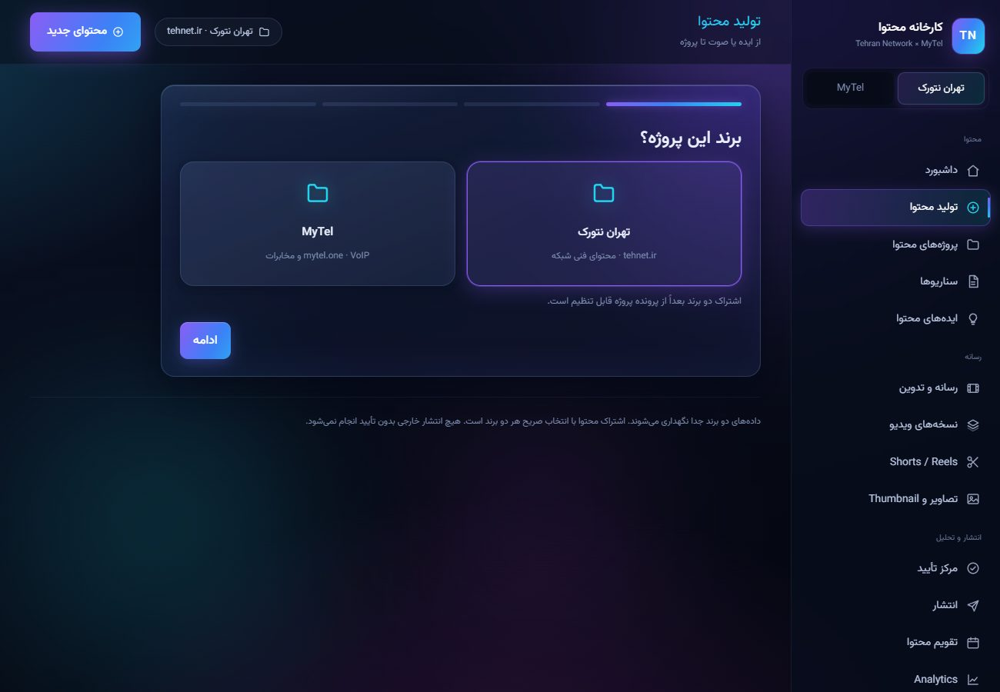

**۱ — نوار پیشرفت ۴ مرحله‌ای:** هر خط = یک مرحله؛ بنفش = جاری، سبز = انجام‌شده.
**۲ — کارت‌های بزرگ ورودی:** متن / ضبط صدا / آپلود فایل — کارت انتخابی حلقهٔ بنفش می‌گیرد.

#### کارت «متن / ایده»
- تایپ موضوع؛ سریع‌ترین مسیر.
#### کارت «ضبط صدا»
- **دکمهٔ «شروع ضبط»:** میکروفون باز می‌شود؛ دکمه قرمز ضبط فعال می‌شود؛ «پایان ضبط» فایل را آماده می‌کند؛ بعدش دکمهٔ ساخت فعال می‌شود.
#### کارت «آپلود فایل صوتی»
- انتخاب فایل (تا ۲۰GB). نام و حجم نمایش داده می‌شود.
#### «ادامه» / «بازگشت»
- ناوبری بین مراحل؛ چیزی ذخیره نمی‌شود تا «ساخت پروژه» را نزنید.
#### «ساخت پروژه و تبدیل به متن» (با صوت)
- **بعد از کلیک:** پروژه ساخته می‌شود، صوت آپلود و تبدیل گفتار (GPU اگر موجود) در صف می‌رود؛ پیشرفت زنده می‌بینید و بعد به صفحهٔ پروژه می‌روید.
- **تأیید لازم؟** خیر — ولی هیچ‌چیز منتشر نمی‌شود.

---

## صفحهٔ پروژه — نمای کلی و خط تولید

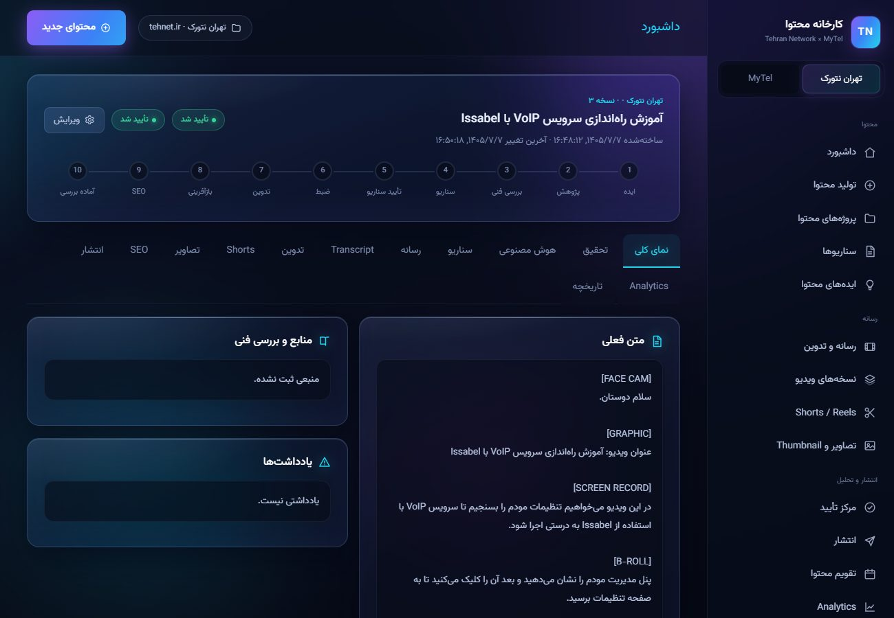

**۱ — هدر چسبان:** برند + نسخه + وضعیت تأیید سناریو/انتشار.
**۲ — Stepper:** مرحلهٔ جاری بنفش درخشان؛ انجام‌شده‌ها سبز با تیک.
**۳ — تب‌های زمینه‌ای:** ۱۲ بخش؛ تب فعال زیرخط فیروزه‌ای می‌گیرد.

### تب تحقیق
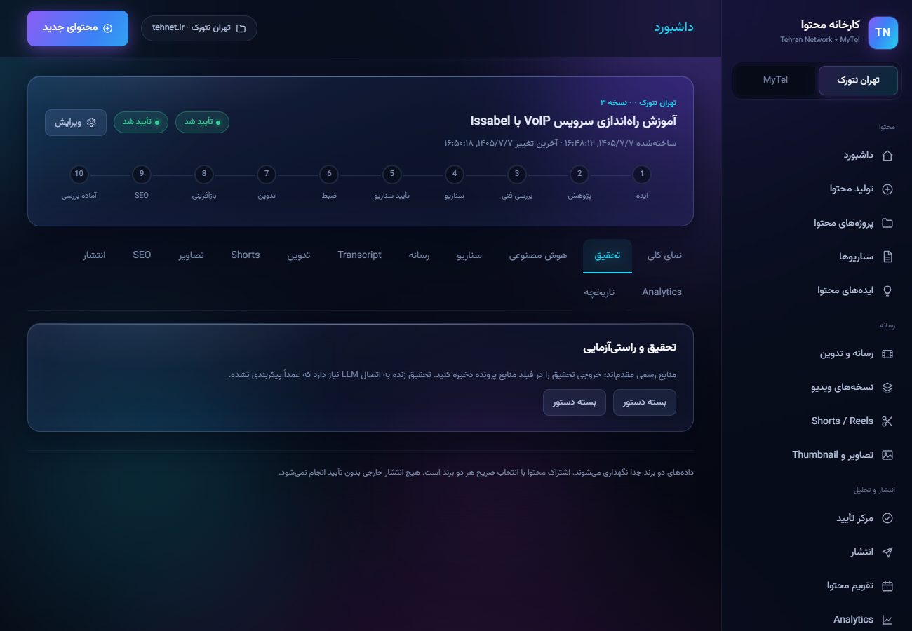
- نکته‌های کلیدی، ادعاهای فنی، و منابع با وضعیت واقعی: «منبع زنده» (پاسخ HTTP داد) یا «نیاز به بررسی». هیچ نشانی جعلی نیست.

### تب هوش مصنوعی (مهم‌ترین)
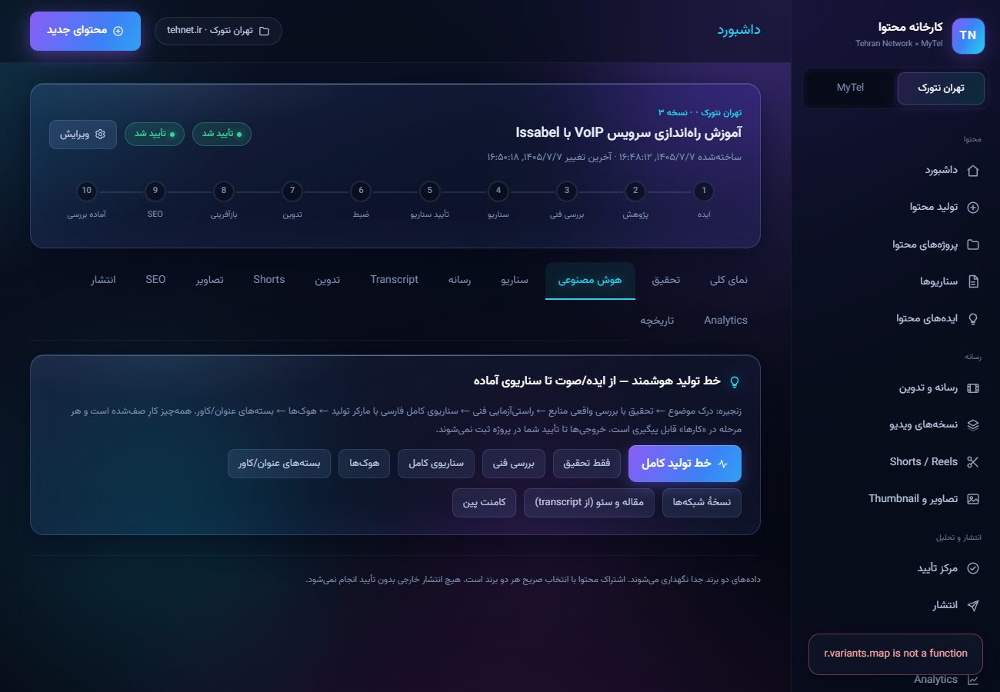
#### «خط تولید کامل» (بنفش)
- **بعد از کلیک:** زنجیرهٔ تحقیق→بررسی فنی→سناریو→هوک→بسته‌ها به‌صورت کار صف‌شده اجرا و پیشرفت هر مرحله لاگ می‌شود.
- **تأیید؟** خیر در اجرا؛ ولی خروجی‌ها منتظر تأیید شما می‌مانند.
#### دکمه‌های تکی (تحقیق/بررسی/سناریو/هوک/بسته/شبکه‌ها/مقاله/کامنت)
- همان موتورها فقط برای یک خروجی.
#### «ثبت به‌عنوان سناریوی پروژه»
- **تأیید لازم؟ بله** — دیالوگ تأیید می‌آید: نسخهٔ جدید ساخته می‌شود و تأییدهای قبلی باطل می‌شوند.

### تب سناریو
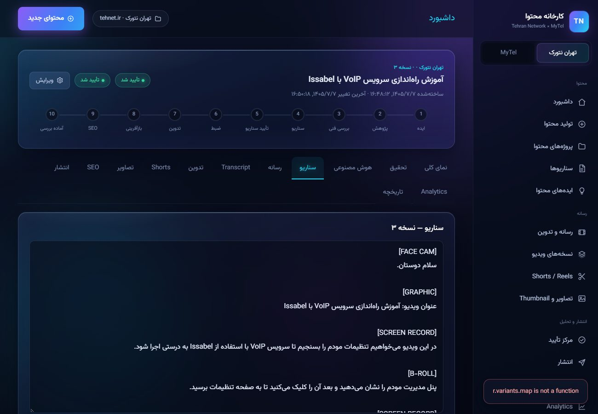
#### «ذخیرهٔ نسخهٔ تازه»
- متن ویرایش‌شده را به‌عنوان نسخهٔ جدید ثبت می‌کند (تاریخچه می‌ماند).
#### «تأیید سناریو برای ضبط» (بنفش)
- **بعد از کلیک:** پروژه رسماً «آمادهٔ ضبط» می‌شود؛ stepper جلو می‌رود. تأیید انتشار جدا است.

---

## رسانه و همگام‌سازی

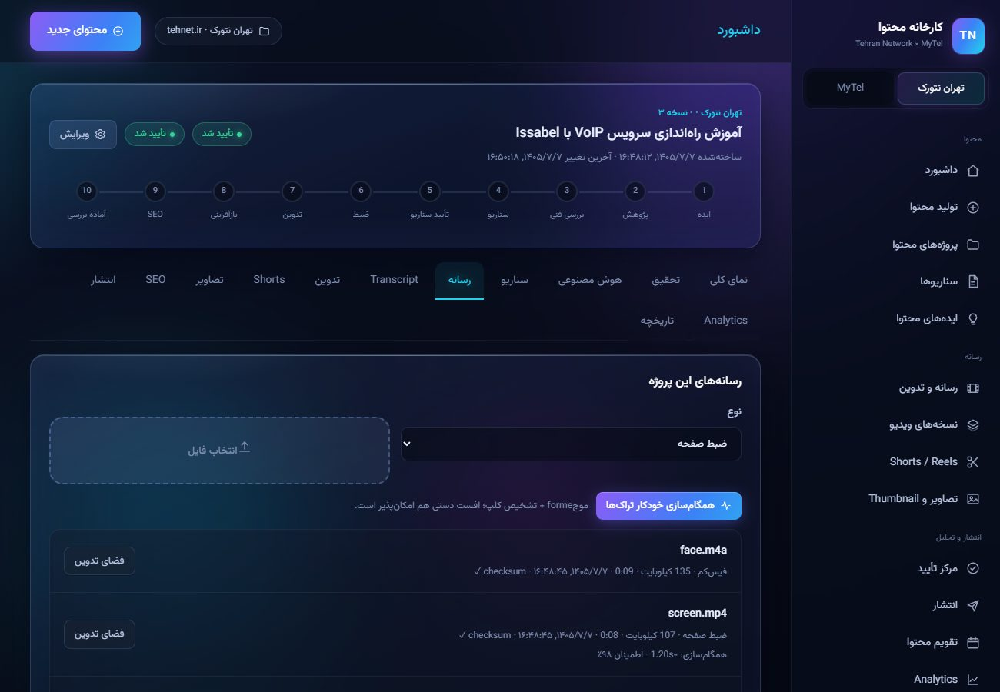

#### ناحیهٔ آپلود (خط‌چین)
- کلیک = انتخاب فایل؛ hover بنفش می‌شود. نوع (صفحه/فیس‌کم/صدای جدا) و پروژهٔ مقصد را قبلش انتخاب کنید.
#### «همگام‌سازی خودکار تراک‌ها»
- **بعد از کلیک:** همبستگی موج + کلپ؛ نتیجه زیر هر فایل: «‎+X.XXs · اطمینان ٪YY». اطمینان <۶۰٪ ⚠نیاز به بازبینی.
- **تأیید؟** خیر؛ فقط ثبت افست (فایل خام دست نمی‌خورد).
#### «بهبود صوت»
- نسخهٔ بهبودیافتهٔ NEW (نویزگیر ملایم) می‌سازد؛ اصل سالم می‌ماند.

## Transcript

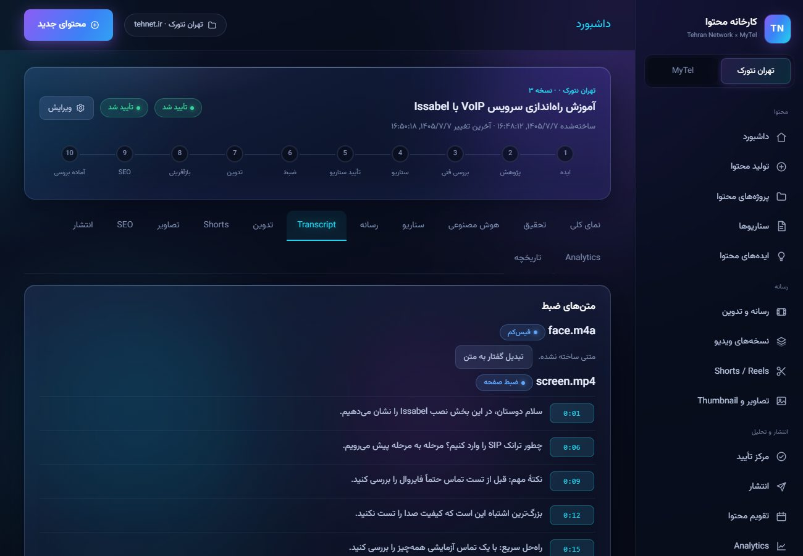
- **چیپ‌های زمان (فيروزه‌ای):** کلیک = پرش پخش‌کننده به همان لحظه.
- **«ذخیرهٔ نسخهٔ تازه»** (در بخش ویرایش): نسخهٔ جدید متن؛ قبلی‌ها می‌مانند.

## تدوین (مهم‌ترین صفحهٔ بازبینی)

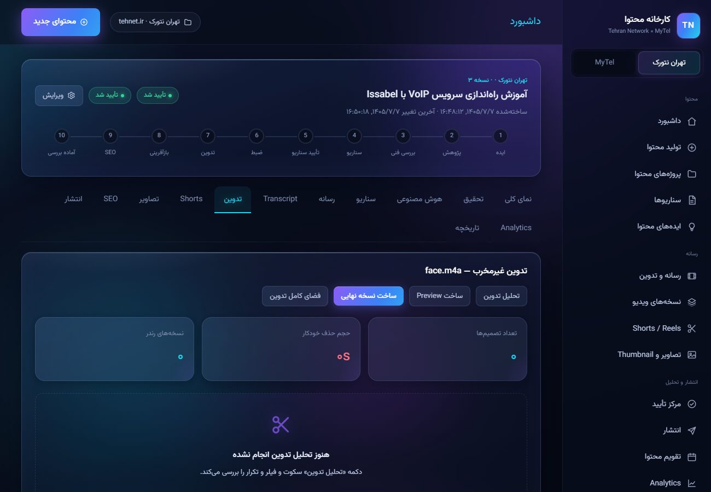

**۱ — دکمه‌های اقدام:** تبدیل گفتار / تحلیل تدوین / ساخت Preview / ساخت نسخهٔ نهایی.
**۲ — گزارش فارسی:** هر تصمیم با بازهٔ زمانی، دلیل و درصد اطمینان؛ حاشیهٔ رنگی: قرمز=حذف‌شده، زرد=نیاز بررسی، سبز=نگه‌داشته.

#### «تحلیل تدوین»
- سکوت/فیلر/تکرار واضح را خودکار «حذف» می‌کند؛ مشکوک‌ها فقط «پیشنهاد».
#### «بازگردانی» (در هر ردیف حذف‌شده)
- **بعد از کلیک:** آن برش به محتوا برمی‌گردد (حتی بعد از تحلیل مجدد می‌ماند) و در رندر بعدی اعمال می‌شود.
#### «نگه‌داشتن» / «حذف کن» (ردیف‌های زرد)
- تصمیم شما روی موارد مشکوک.
#### «ساخت Preview»
- خروجی سریع بازبینی؛ بدون تأیید.
#### «ساخت نسخهٔ نهایی» (بنفش)
- **تأیید لازم؟ بله** — به مرکز تأیید می‌رود؛ فقط بعد از تأیید شما رندر FINAL ساخته می‌شود.

---

## Shorts

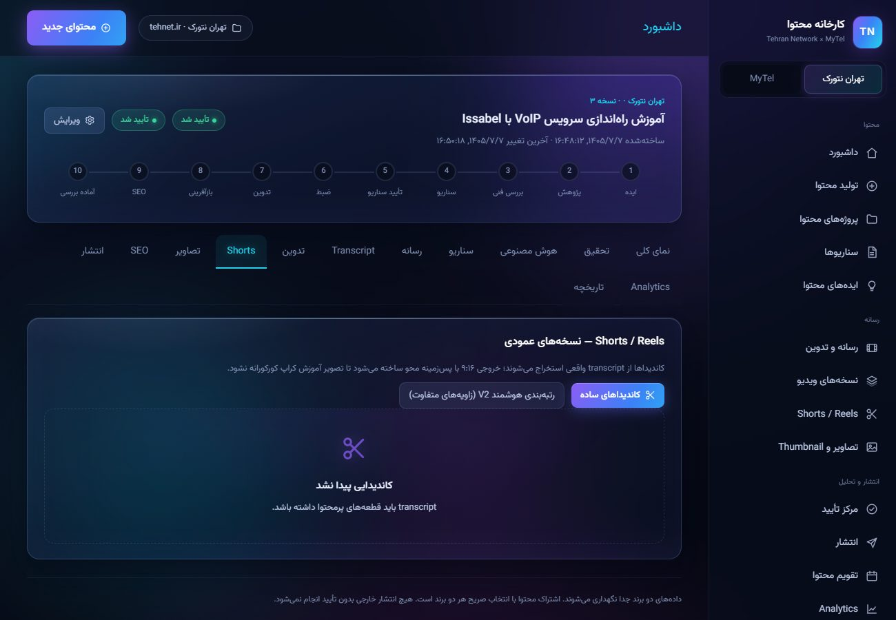
#### «رتبه‌بندی هوشمند V2»
- کاندیداها با زاویه‌های متفاوت + «چرا» هر کاندیدا.
#### «رندر این کاندیدا» (در هر کارت)
- فقط همان برش عمودی ۹:۱۶ ساخته می‌شود (پس‌زمینهٔ محو؛ کراپ کورکورانه نیست).

## انتشار (Publishing)

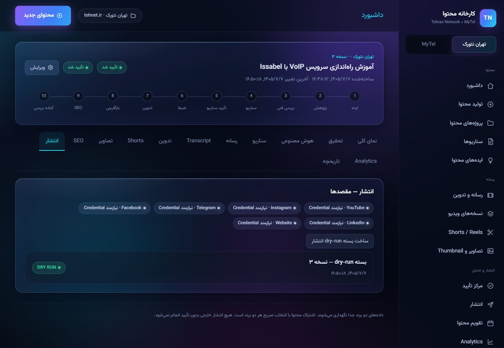
- کارت هر پلتفرم وضعیت صادقانه دارد (فعلاً «نیازمند Credential» تا کلید بدهید).
#### «درخواست پیش‌نویس» (وردپرس)
- پیش‌نویس DRAFT در سایت می‌سازد — نه انتشار. نیاز به Application Password دارد.
#### بستهٔ Dry-Run
- پس از تأیید انتشار ساخته می‌شود: دقیقاً نشان می‌دهد چه چیزی کجا می‌رفت؛ ارسال واقعی ندارد.

---

## مرکز تأیید

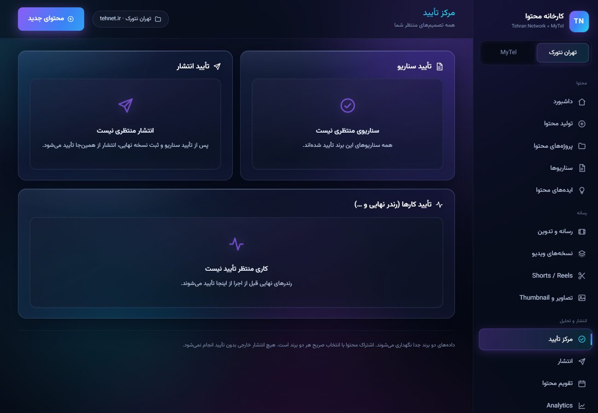

هر کارت: چه چیزی، کدام پروژه/برند، چه زمانی، چه نسخه‌ای.
#### «تأیید» (بنفش)
- مسیر بعدی فعال می‌شود (مثلاً رندر نهایی اجرا می‌شود) — idempotent؛ دابل‌کلیک کار تکراری نمی‌سازد.
#### «رد» / «نیاز به اصلاح»
- رد قطعی است؛ «اصلاح» یعنی بازگردانده می‌شود تا نسخهٔ بهتر بدهید.
- **اکشن‌های عمومی/خطرناک ظاهر متمایز (قرمز) دارند تا اشتباهی تأیید نشوند.**

## سئو (SEO)

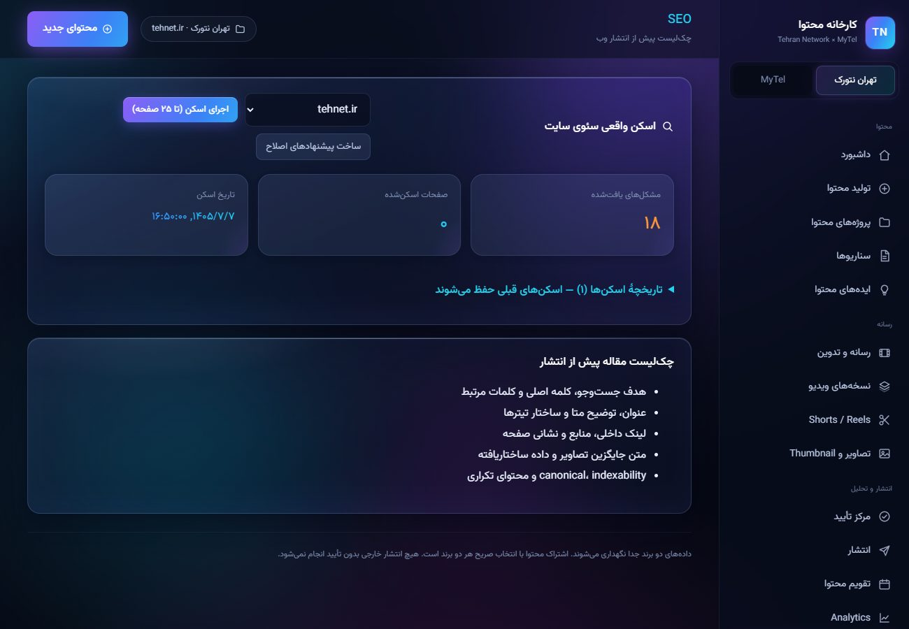
#### «اجرای اسکن (تا ۲۵ صفحه)»
- خزش واقعی سایت؛ نتیجه + تاریخچهٔ append-only.
#### «ساخت پیشنهادهای اصلاح»
- از آخرین اسکن، کارت مشکل با راه‌حل مشخص می‌سازد؛ به Analytics می‌رود برای تأیید.

## Analytics

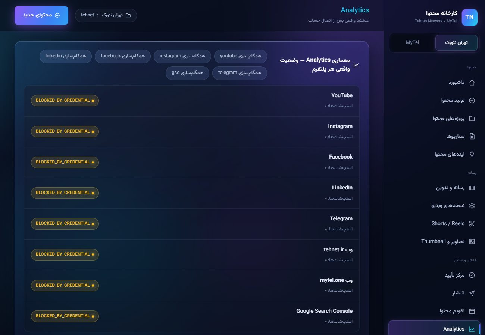
- بدون اتصال حساب: قفل صادقانه («حساب متصل نیست») — **هیچ عدد نمونه‌ای که واقعی به‌نظر برسد نمایش داده نمی‌شود**.
#### «ثبت رکورد پایه برای پروژهٔ انتخابی»
- عملکرد واقعی انتشارتان را دستی وارد می‌کنید تا زمان‌بندی تطبیقی و پیشنهادها از دادهٔ خودتان شروع شوند.
#### «همگام‌سازی [پلتفرم]»
- با credential متصل، دادهٔ واقعی می‌آورد؛ بدون آن، پیام دقیق چه کلیدی لازم است.

## برنامه‌ریز محتوا

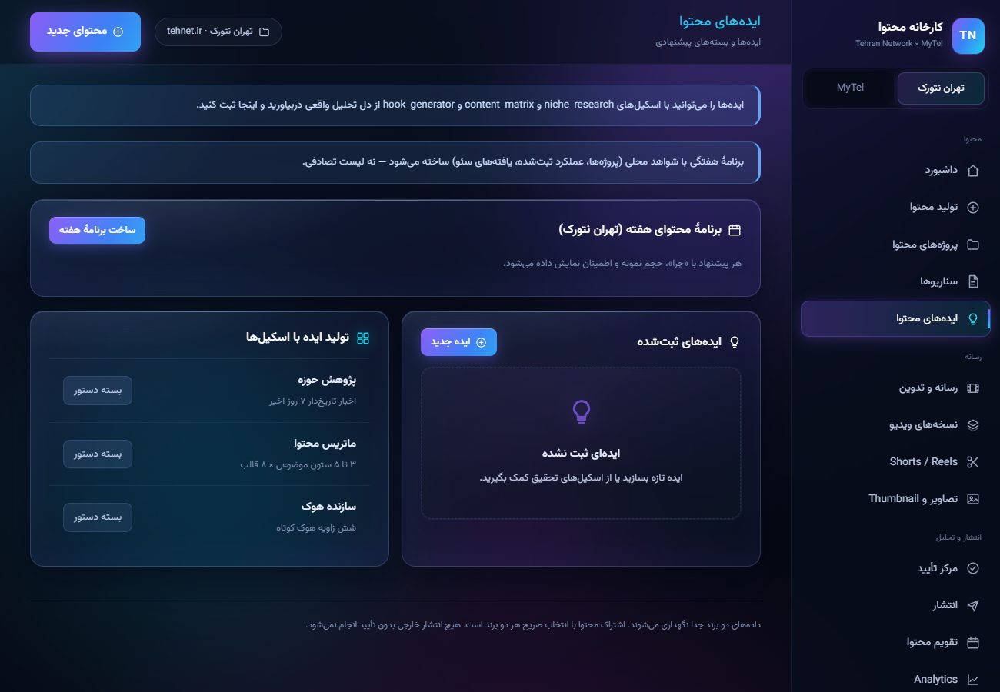
#### «ساخت برنامهٔ هفته»
- هر پیشنهاد: عنوان/پلتفرم/نوع + «چرا» + حجم نمونه + درصد اطمینان — مبتنی بر شواهد محلی، نه لیست تصادفی.

## کارها (Jobs)

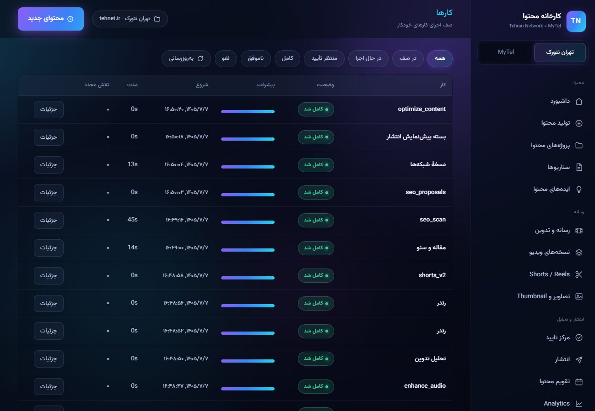
- وضعیت‌ها رنگ‌کد شده‌اند؛ **POSSIBLY_STUCK نارنجی چشمگیر است** و «بازبینی دستی» می‌خواهد (سیستم خودکار ری‌استارت نمی‌کند).
#### «تلاش دوباره» / «لغو»
- Retry تا سقف ۵ بار؛ بعدش مداخلهٔ دستی. جزئیات هر کار: لاگ کامل اجرا.

## اتصال حساب‌ها (صفحهٔ اختصاصی + OAuth)

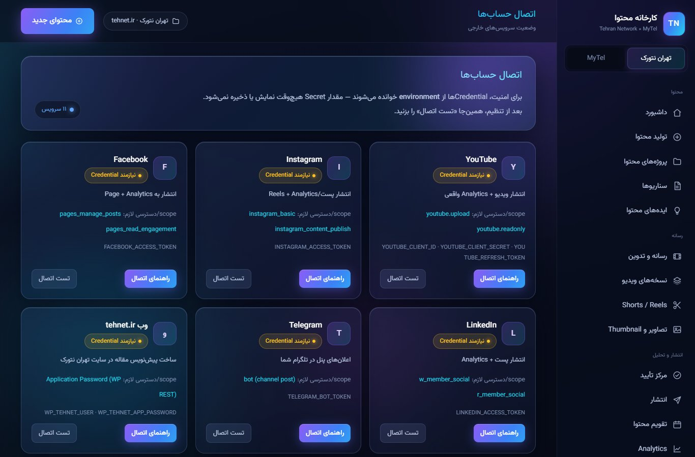
- ۱۱ کارت: وضعیت (متصل/BLOCKED_BY_CREDENTIAL با نام دقیق متغیر غایب)، scope لازم، راهنمای گام‌به‌گام.
#### «اتصال حساب» (فقط YouTube/Instagram/Facebook/LinkedIn)
- **کاربرد:** پنجرهٔ OAuth سرویس باز می‌شود؛ بعد از اجازه، توکن امن در دیتابیس محلی ذخیره و وضعیت «متصل» می‌شود.
- **پیش‌نیاز:** کلاینت OAuth همان سرویس در environment (مثل YOUTUBE_CLIENT_ID/SECRET).
#### «تست اتصال»
- بررسی واقعی؛ نتیجه صادقانه. **هیچ‌وقت مقدار Secret نشان داده نمی‌شود.**

## فضای ذخیره‌سازی / سلامت / اعلان‌ها

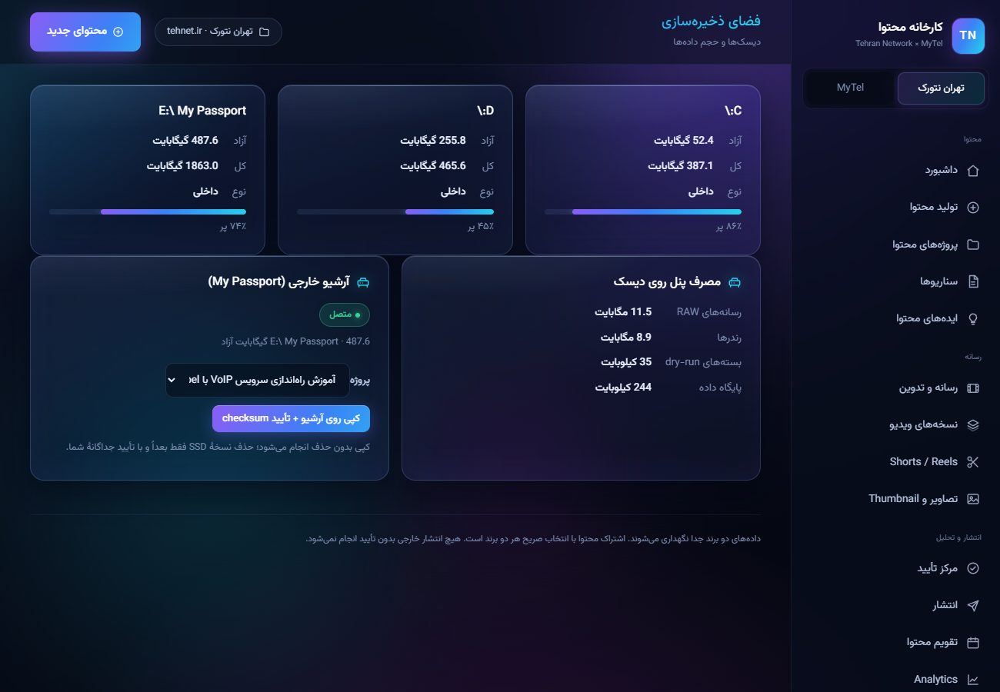 · 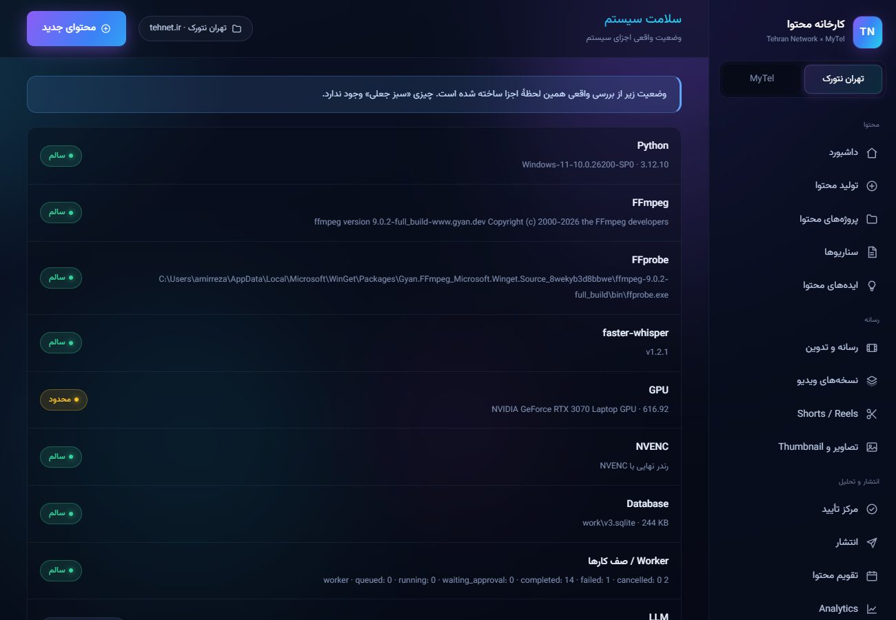 · 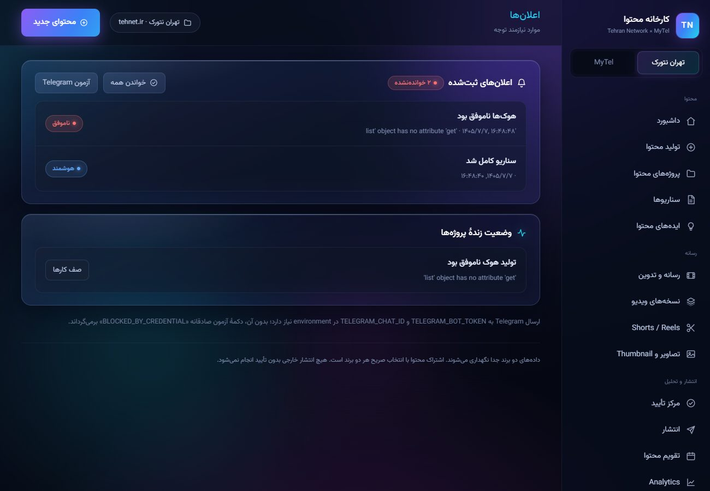
- ذخیره‌سازی: دیسک‌ها + وضعیت My Passport؛ **«کپی روی آرشیو + تأیید checksum» تأیید می‌خواهد و حذف نسخهٔ اصلی تأیید جداگانه.**
- سلامت: «آزمون GPU» استنتاج واقعی CUDA اجرا می‌کند؛ سبز جعلی نداریم.

## موبایل (Poco X7 Pro)

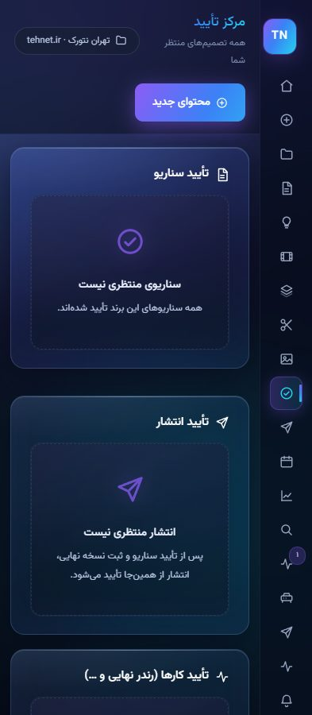
- نوار کنار به آیکون جمع می‌شود؛ مرکز تأیید تک‌ستون و دکمه‌های اصلی در دسترس؛ متن فارسی خوانا می‌ماند.

## امنیت و ورود (اختیاری)

با تنظیم `ADMIN_USER` و `ADMIN_PASSWORD` در environment، همهٔ تغییرات پنل محافظت‌شده می‌شوند:
- در باز شدن پنل، کارت **ورود** نمایش داده می‌شود (نام کاربری/رمز).
- بعد از ورود، نشست ۱۲ ساعته معتبر است؛ با مخفی‌شدن تب نشست نمی‌میرد.
- بدون این متغیرها (استفادهٔ فقط-محلی) پنل مثل قبل بدون ورود کار می‌کند.
